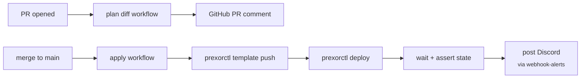

A GitHub Actions pipeline that pushes templates from a Git repo to the
PrexorCloud controller and triggers rolling deployments. PRs preview
the plan diff as a comment; merges to `main` apply for real. End state
is a one-PR-one-deploy workflow with full audit trail in both Git and
the controller's audit log.

## What you'll build



End state: a Git repo with `templates/<group>/` directories and a
`groups/<group>.yml` config per group. Two GitHub Actions workflows:
`plan.yml` for PR previews and `apply.yml` for merges.

## Prerequisites

- PrexorCloud v1.0+ controller reachable from GitHub-hosted runners
  (or a self-hosted runner inside your network).
- A long-lived API token for the CI user. Create with:
  ```bash
  prexorctl user create ci --role deployer
  prexorctl token create --user ci --description "github-actions" --ttl 8760h
  # -> Token: prxa_xxxxxxxxxxxxxxxx
  ```
  The `deployer` role needs `groups.update`, `templates.push`,
  `deployments.create`. Customize via `prexorctl role create`.
- The token stored as a GitHub Actions secret named `PREXOR_TOKEN`,
  and the controller URL as `PREXOR_CONTROLLER`.

## 1. Lay out the repo

```
my-network/
├── .github/workflows/
│   ├── plan.yml
│   └── apply.yml
├── groups/
│   ├── proxy.yml
│   ├── lobby.yml
│   └── bedwars.yml
├── templates/
│   ├── proxy/
│   ├── lobby/
│   └── bedwars/
└── network.yml
```

`groups/*.yml` and `network.yml` are the same shapes as
[Your First Network](/getting-started/your-first-network/).

## 2. The plan workflow

`.github/workflows/plan.yml` runs on every PR and posts a diff
comment showing what would change.

```yaml
# .github/workflows/plan.yml
name: plan
on:
  pull_request:
    paths:
      - 'groups/**'
      - 'templates/**'
      - 'network.yml'

jobs:
  plan:
    runs-on: ubuntu-latest
    permissions:
      pull-requests: write
    steps:
      - uses: actions/checkout@v4
      - name: Install prexorctl
        run: |
          curl -fsSL "https://github.com/prexorjustin/prexorcloud/releases/latest/download/prexorctl-linux-amd64" \
            -o /usr/local/bin/prexorctl
          chmod +x /usr/local/bin/prexorctl
          prexorctl version

      - name: Login
        env:
          PREXOR_TOKEN: ${{ secrets.PREXOR_TOKEN }}
          PREXOR_CONTROLLER: ${{ secrets.PREXOR_CONTROLLER }}
        run: |
          prexorctl config set controller "$PREXOR_CONTROLLER"
          prexorctl login --token "$PREXOR_TOKEN"

      - name: Plan
        id: plan
        run: |
          {
            echo "## Plan diff"
            echo
            echo '```diff'
            for f in groups/*.yml; do
              prexorctl group plan -f "$f"        # exits 0 with diff on stdout
            done
            for d in templates/*/; do
              prexorctl template plan "$d"
            done
            prexorctl network plan -f network.yml
            echo '```'
          } > /tmp/plan.md

      - name: Comment
        uses: marocchino/sticky-pull-request-comment@v2
        with:
          path: /tmp/plan.md
```

`prexorctl group plan` and `template plan` are read-only — they show
what `apply` would do without persisting anything. The plan output is
deterministic per controller revision (template hash + group config
hash).

## 3. The apply workflow

`.github/workflows/apply.yml` runs on merges to `main`, applies every
changed file in dependency order, and waits for each deployment to
complete.

```yaml
# .github/workflows/apply.yml
name: apply
on:
  push:
    branches: [main]
    paths:
      - 'groups/**'
      - 'templates/**'
      - 'network.yml'

concurrency:
  group: apply-${{ github.ref }}
  cancel-in-progress: false       # never cancel a running deploy

jobs:
  apply:
    runs-on: ubuntu-latest
    timeout-minutes: 30
    steps:
      - uses: actions/checkout@v4
      - name: Install prexorctl
        run: |
          curl -fsSL "https://github.com/prexorjustin/prexorcloud/releases/latest/download/prexorctl-linux-amd64" \
            -o /usr/local/bin/prexorctl
          chmod +x /usr/local/bin/prexorctl

      - name: Login
        env:
          PREXOR_TOKEN: ${{ secrets.PREXOR_TOKEN }}
          PREXOR_CONTROLLER: ${{ secrets.PREXOR_CONTROLLER }}
        run: |
          prexorctl config set controller "$PREXOR_CONTROLLER"
          prexorctl login --token "$PREXOR_TOKEN"

      - name: Apply groups
        run: prexorctl group apply -f groups/

      - name: Push templates
        run: |
          for d in templates/*/; do
            prexorctl template push "$d"
          done

      - name: Apply network composition
        run: prexorctl network apply -f network.yml

      - name: Roll deploys
        env:
          GROUPS: lobby bedwars
        run: |
          for g in $GROUPS; do
            prexorctl deploy "$g" \
              --strategy rolling \
              --canary-instances 1 \
              --health-gate \
              --min-healthy 60 \
              --auto-rollback \
              --wait
          done

      - name: Smoke test
        run: prexorctl status && prexorctl group list
```

`--wait` blocks until the deployment reaches `COMPLETED` or `FAILED`,
so the workflow fails the job if a rollout fails. The
`--auto-rollback` flag means a failed deploy already restored the
previous revision before we hit the smoke test.

## 4. Cancel a stuck deploy

If a deploy hangs (e.g. canary boots forever), cancel from your
laptop:

```bash
prexorctl deploy list lobby --status running
prexorctl deploy cancel lobby <revision>
```

The controller cancels the workflow intent (`workflow_intent`
collection in Mongo) and the rolling reconciler unwinds: any in-flight
batch finishes, then the deploy is marked `CANCELLED`. No partial
state.

## How to verify it works

Open a trivial PR that bumps a comment in `templates/lobby/` and
watch:

- The `plan` workflow posts a diff comment within ~30 seconds.
- The diff shows the template's content hash changing.
- After merge, the `apply` workflow:
  - Pushes the new template (visible in `prexorctl template versions
    lobby`).
  - Triggers a rolling deploy (visible in `prexorctl deploy list
    lobby`).
  - Waits for completion.
  - Smoke check passes.

The audit log records every step:

```bash
prexorctl audit query --since "5 min ago" --user ci
# 12:00:01  template.push     lobby v44
# 12:00:02  deployment.create lobby rev 44 strategy=rolling
# 12:01:30  deployment.complete lobby rev 44 outcome=success
```

## Common pitfalls

| Symptom | Likely cause |
|---|---|
| `apply` deploys land out of order | Use `prexorctl group apply -f groups/` (directory mode) — it sorts by `dependsOn`. |
| Token expires mid-pipeline | TTL too short. Re-issue with `--ttl 8760h` (1 year) and rotate via the `rotate-secrets` runbook. |
| Plan comment shows everything as changed | Whitespace drift in templates. Configure your editor's `.editorconfig`; the controller hashes raw bytes. |
| Concurrent merges step on each other | The `concurrency` block above serialises; without it, two workflows can race the same group. |
| `--wait` hangs past `timeout-minutes` | A canary is stuck. Cancel from local CLI; the workflow will fail and report the unblock. |

## Where to go next

- [Guides → Rolling Deployments](/guides/rolling-deployments/) —
  what each rollout flag does, with health-gate semantics.
- [Recipes → Discord Notifications](/recipes/discord-notifications/) —
  pipe `deployment_completed` events to a Discord channel for
  visibility.
- [Operations → Production Checklist](/operations/production-checklist/)
  — the items to check off before pointing this pipeline at prod.
