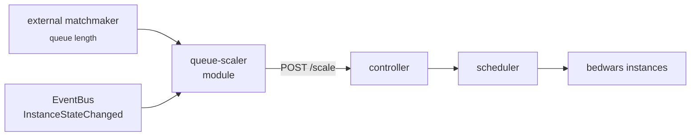

The built-in scaling evaluator covers player utilisation, time-bound
overlays, and manual targets — see
[Guides → Custom Scaling Rules](/guides/custom-scaling-rules/). When
your decision depends on something the evaluator can't see (queue
depth in a matchmaker, ticketed-event sign-ups, an external dashboard
button), write a platform module that pushes scaling targets via the
controller's REST API.

## What you'll build



End state: a `queue-scaler` module that polls a matchmaker's queue
endpoint, computes a desired instance count, and PUTs it via
`POST /api/v1/groups/<name>/scale` whenever the answer changes. The
controller's scheduler does the actual placement; the module owns the
decision.

## Prerequisites

- PrexorCloud v1.0+ controller in `production` profile.
- Java 21+ and a working `gradle` for the module build.
- The `cloud-module-template` scaffold (`prexorctl module new
  queue-scaler` produces it).
- A target group (`bedwars`) already running with `mode: STATIC`. We'll
  let the module drive `desired` directly rather than fight the
  built-in DYNAMIC evaluator.

## 1. Scaffold the module

```bash
prexorctl module new queue-scaler --package me.example.queuescaler
cd cloud-module-queue-scaler
```

The scaffold generates `module.yaml`, the entry-point class, gradle
config, and a unit-test harness. Edit `src/main/module/module.yaml`:

```yaml
manifestVersion: 1
id: queue-scaler
version: 1.0.0
hosts: [controller]
backend:
  controller:
    entrypoint: me.example.queuescaler.QueueScalerModule
storage:
  mongo: true       # we'll persist the last-known desired count
capabilities:
  requires: []      # nothing — we use the controller's REST API
  provides: []
```

`hosts: [controller]` means this is a controller-side platform module.
The same module template can target `daemon` or `[controller, daemon]`
for daemon-side decisions; out of scope here.

## 2. Implement the module

`PlatformModule` is the lifecycle interface. The module wires up an
HTTP client at `onLoad`, starts a scheduled poll at `onStart`, and
unwinds at `onStop`.

```java
// src/main/java/me/example/queuescaler/QueueScalerModule.java
package me.example.queuescaler;

import java.net.URI;
import java.net.http.HttpClient;
import java.net.http.HttpRequest;
import java.net.http.HttpResponse;
import java.time.Duration;
import java.util.Map;
import java.util.concurrent.ScheduledFuture;
import java.util.concurrent.TimeUnit;

import com.fasterxml.jackson.databind.ObjectMapper;
import me.prexorjustin.prexorcloud.api.module.platform.ModuleContext;
import me.prexorjustin.prexorcloud.api.module.platform.PlatformModule;
import org.slf4j.Logger;

public final class QueueScalerModule implements PlatformModule {

    private static final String MATCHMAKER_URL = "http://matchmaker.internal/queue/bedwars";
    private static final String GROUP = "bedwars";
    private static final int PLAYERS_PER_INSTANCE = 16;
    private static final int MIN = 1;
    private static final int MAX = 24;

    private HttpClient http;
    private ObjectMapper json;
    private Logger log;
    private ScheduledFuture<?> task;

    @Override
    public void onLoad(ModuleContext ctx) {
        this.http = ctx.httpClient();
        this.json = ctx.json();
        this.log = ctx.logger();
    }

    @Override
    public void onStart(ModuleContext ctx) {
        this.task = ctx.scheduler().scheduleAtFixedRate(
            () -> tick(ctx), 0, 30, TimeUnit.SECONDS);
        log.info("queue-scaler tick scheduled every 30s for group={}", GROUP);
    }

    @Override
    public void onStop(ModuleContext ctx) {
        if (task != null) task.cancel(false);
        task = null;
    }

    private void tick(ModuleContext ctx) {
        try {
            int queued = fetchQueueLength();
            int desired = clamp(MIN, MAX, (queued / PLAYERS_PER_INSTANCE) + 1);
            postScale(desired);
            log.debug("queue={} desired={}", queued, desired);
        } catch (Exception e) {
            log.warn("queue-scaler tick failed: {}", e.getMessage());
        }
    }

    private int fetchQueueLength() throws Exception {
        var req = HttpRequest.newBuilder(URI.create(MATCHMAKER_URL))
            .timeout(Duration.ofSeconds(5))
            .GET().build();
        var resp = http.send(req, HttpResponse.BodyHandlers.ofString());
        @SuppressWarnings("unchecked")
        Map<String, Object> body = json.readValue(resp.body(), Map.class);
        return ((Number) body.get("length")).intValue();
    }

    private void postScale(int desired) throws Exception {
        // Use the module's controller-internal token from ctx.host().selfToken().
        // The host token has groups.update on the controller.
        var body = json.writeValueAsString(Map.of("targetInstances", desired));
        var req = HttpRequest.newBuilder(
                URI.create("http://localhost:8080/api/v1/groups/" + GROUP + "/scale"))
            .timeout(Duration.ofSeconds(5))
            .header("Content-Type", "application/json")
            .header("Authorization", "Bearer " + ctx().host().selfToken())
            .POST(HttpRequest.BodyPublishers.ofString(body)).build();
        http.send(req, HttpResponse.BodyHandlers.discarding());
    }

    private static int clamp(int lo, int hi, int v) {
        return Math.max(lo, Math.min(hi, v));
    }

    // helpers omitted (ctx() captured in onStart for the closure)
}
```

`ctx.scheduler()` is the per-module `TaskScheduler` exposed by
`ModuleContext` (Layer 3 of the API overhaul). `ctx.host().selfToken()`
returns a controller-internal bearer that's valid only for the
module's lifetime — never use long-lived API tokens inside a module.

## 3. Build, sign, install

```bash
cd cloud-module-queue-scaler
./gradlew shadowJar
cosign sign-blob --bundle build/libs/queue-scaler.cosign.bundle build/libs/queue-scaler.jar
prexorctl module install build/libs/queue-scaler.jar
prexorctl module list
# queue-scaler   1.0.0   ACTIVE
```

The Cosign sign step is required only when running the controller in
`production` with `modules.signing.required: true`; for local
iteration, set `required: false` in `controller.yml`.

## 4. Watch it scale

```bash
prexorctl events follow --filter scaling
# 12:00:30  GROUP_SCALE  bedwars  desired=3 source=queue-scaler
# 12:00:31  INSTANCE_SCHEDULED  bedwars-2  node-1
# 12:00:31  INSTANCE_SCHEDULED  bedwars-3  node-2
# 12:01:00  GROUP_SCALE  bedwars  desired=3 source=queue-scaler  noop
```

The `source` field on `GROUP_SCALE` is the API caller's identity —
your module's name. The built-in evaluator emits `source=evaluator`,
manual `prexorctl group scale` emits `source=user:<username>`. This
keeps audit-log triage easy.

## How to verify it works

Three checks:

```bash
# 1. The module's tick runs every 30s
prexorctl logs controller --follow | grep queue-scaler
# 12:00:30 INFO  module:queue-scaler queue=42 desired=3
# 12:01:00 INFO  module:queue-scaler queue=48 desired=4

# 2. Group desired tracks the module's decisions
prexorctl group info bedwars | grep DESIRED
# DESIRED   4

# 3. Audit log attributes the scale to the module
prexorctl audit query --filter group.scale --since "5 min ago"
# 12:01:00  group.scale  bedwars  desired=4  by=module:queue-scaler
```

Stop the module:

```bash
prexorctl module deactivate queue-scaler
```

The group keeps its last `desired`; nothing reverts. If you want
auto-revert behaviour on module stop, set `desired = MIN` in `onStop`.

## Common pitfalls

| Symptom | Likely cause |
|---|---|
| `503 capability unavailable` from `/scale` | The group's `scaling.mode` is `DYNAMIC` and is fighting your module. Switch the group to `STATIC` or use `--force` semantics. |
| Module activates then immediately deactivates | `Mongo` storage requested but production profile not enabled. Check `runtime.profile`. |
| Tick never fires | `onStart` never called — module is in `INSTALLED` not `ACTIVE`. Check capability `requires` block; if anything's missing the module is paused. |
| Audit log shows `source=anonymous` | You used a long-lived API token instead of `ctx.host().selfToken()`. The module token is the right answer. |

## Where to go next

- [Reference → Module SDK](/reference/module-sdk/) — full
  `ModuleContext`, `EventBus`, `TaskScheduler`, capability surfaces.
- [Guides → Custom Scaling Rules](/guides/custom-scaling-rules/) —
  the built-in alternatives that don't require code.
- [Concepts → Plugins](/concepts/plugins/) — when a server-side plugin
  is the right tool instead (proxy/server only, no controller access).
