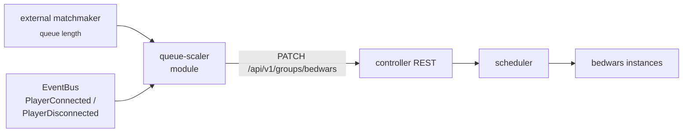

The controller's built-in evaluator scales a `DYNAMIC` group between
`minInstances` and `maxInstances` using player load, with time-bound floor
overlays available through Event Choreography — see
[Guides → Time-bound scaling rules](/guides/custom-scaling-rules/). When the
decision depends on something the evaluator cannot see — queue depth in an
external matchmaker, ticketed-event sign-ups, a dashboard button — write a
platform module. The module subscribes to cluster events through
`ModuleContext.events()`, computes a target, and writes it to the group through
the controller's REST API.

This recipe builds `queue-scaler`: a controller-side module that tracks live
player counts from `PlayerConnectedEvent` / `PlayerDisconnectedEvent`, polls an
external matchmaker for queue depth on a fixed cadence, and sets the
`bedwars` group's `minInstances` floor so the scheduler keeps that many
instances running.

## What you'll build



The module owns the decision; the controller's scheduler owns placement. The
module never starts instances directly — it sets the group's floor and lets the
desired-state planner reconcile.

## How a module reaches the cluster

A controller-side platform module receives a `ModuleContext` in each lifecycle
hook. The surface relevant here:

| `ModuleContext` member | Use |
|---|---|
| `events()` | Subscribe to `PlayerConnectedEvent`, `PlayerDisconnectedEvent`, `InstanceStateChangedEvent`, and the other [`CloudEvent`](#events-you-can-subscribe-to) types. |
| `scheduler()` | A `TaskScheduler` for periodic work. Tasks are cancelled automatically when the module stops. |
| `httpClient()` | A shared outbound `java.net.http.HttpClient` for calls outside the cluster (the matchmaker) and to the controller's own REST API. |
| `json()` | A pre-configured Jackson `ObjectMapper` (java-time, ISO-8601, lenient on unknown fields). |
| `requireMongoStorage()` | A `ModuleDataStore` scoped to this module's collection prefix, for persisting state across restarts. |
| `logger()` | An SLF4J logger namespaced `module:<id>`. |

There is no in-process "scale this group" capability and no module-issued bearer
token. A module that mutates cluster state does it the same way the CLI and
dashboard do: an authenticated REST call. The module logs in once with an
operator-provisioned account, caches the JWT, and uses it for
`PATCH /api/v1/groups/{name}`.

## Prerequisites

- A running PrexorCloud controller you can reach over HTTP.
- The PrexorCloud monorepo checked out, with a working `./gradlew` (the module
  is a Gradle subproject under `java/cloud-modules/`).
- A target group named `bedwars` already created.
- A controller account with the `GROUPS_UPDATE` permission. `PATCH
  /api/v1/groups/{name}` rejects callers without it with `403`.

## 1. Put the group in MANUAL mode

The built-in evaluator and your module must not both write the floor. Set the
group to `MANUAL` so the evaluator returns no scale-up/scale-down action and
leaves `minInstances` to you. The scheduler still maintains `minInstances` as a
hard floor — that is the lever the module turns.

```bash
prexorctl group update bedwars --scaling-mode MANUAL --min 1 --max 24
prexorctl group info bedwars
```

`scaling-mode` accepts `DYNAMIC` (default), `MANUAL`, and `STATIC`. In `MANUAL`
the evaluator is skipped entirely; the floor you set is the count the scheduler
converges on.

## 2. Scaffold the module

`prexorctl module new` is a local, repo-relative scaffold. It generates a Gradle
subproject under `java/cloud-modules/<name>/` and wires it into
`java/settings.gradle.kts`; it never contacts a controller. Generate a
backend-only module (no plugin, no Vue frontend):

```bash
prexorctl module new queue-scaler \
  --package me.example.queuescaler \
  --no-plugin --no-frontend
```

This produces `java/cloud-modules/queue-scaler/` with `build.gradle.kts`, the
entrypoint class, and `src/main/module/module.yaml`. Edit the manifest:

```yaml
# java/cloud-modules/queue-scaler/src/main/module/module.yaml
manifestVersion: 1
id: queue-scaler
version: 1.0.0
hosts: [controller]
backend:
  controller:
    entrypoint: me.example.queuescaler.QueueScalerModule
storage:
  mongo: true        # persist the last-applied floor across restarts
capabilities:
  provides: []       # this module exports nothing
```

`hosts: [controller]` makes this a controller-side module. `storage.mongo: true`
gives `ModuleContext.requireMongoStorage()` a backing collection; drop it if you
do not need to persist state.

## 3. Implement the module

`PlatformModule` is the entrypoint contract. Every hook is a default no-op, so
override only what you need: `onLoad` to read storage and log in, `onStart` to
subscribe to events and arm the reconcile loop, `onStop` to unwind.

```java
// src/main/java/me/example/queuescaler/QueueScalerModule.java
package me.example.queuescaler;

import java.net.URI;
import java.net.http.HttpClient;
import java.net.http.HttpRequest;
import java.net.http.HttpResponse;
import java.time.Duration;
import java.util.Map;
import java.util.concurrent.atomic.AtomicInteger;

import com.fasterxml.jackson.databind.ObjectMapper;

import me.prexorjustin.prexorcloud.api.ScheduledTask;
import me.prexorjustin.prexorcloud.api.event.events.PlayerConnectedEvent;
import me.prexorjustin.prexorcloud.api.event.events.PlayerDisconnectedEvent;
import me.prexorjustin.prexorcloud.api.module.platform.ModuleContext;
import me.prexorjustin.prexorcloud.api.module.platform.PlatformModule;

import org.slf4j.Logger;

public final class QueueScalerModule implements PlatformModule {

    private static final String CONTROLLER = "http://localhost:8080";
    private static final String MATCHMAKER = "http://matchmaker.internal/queue/bedwars";
    private static final String GROUP = "bedwars";
    private static final int PLAYERS_PER_INSTANCE = 16;
    private static final int MIN_FLOOR = 1;
    private static final int MAX_FLOOR = 24;

    private HttpClient http;
    private ObjectMapper json;
    private Logger log;
    private String bearer;
    private ScheduledTask reconcile;
    private final AtomicInteger livePlayers = new AtomicInteger();
    private volatile int lastFloor = -1;

    @Override
    public void onLoad(ModuleContext ctx) throws Exception {
        this.http = ctx.httpClient();
        this.json = ctx.json();
        this.log = ctx.logger();
        this.bearer = login();
    }

    @Override
    public void onStart(ModuleContext ctx) {
        // Track live player count off the cluster event bus. The filter is
        // ANDed and evaluated on the bus thread, so keep handlers cheap.
        ctx.events().on(PlayerConnectedEvent.class)
                .filter(e -> GROUP.equals(e.group()))
                .subscribe(e -> livePlayers.incrementAndGet());

        ctx.events().on(PlayerDisconnectedEvent.class)
                .filter(e -> GROUP.equals(e.group()))
                .subscribe(e -> livePlayers.updateAndGet(n -> Math.max(0, n - 1)));

        // Reconcile every 30s. scheduleAtFixedRate is (initialDelay, period, task).
        this.reconcile = ctx.scheduler().scheduleAtFixedRate(
                Duration.ZERO, Duration.ofSeconds(30), this::reconcile);

        log.info("queue-scaler armed: group={} period=30s", GROUP);
    }

    @Override
    public void onStop(ModuleContext ctx) {
        if (reconcile != null) {
            reconcile.cancel();
            reconcile = null;
        }
    }

    private void reconcile() {
        try {
            int queued = fetchQueueLength();
            int load = queued + livePlayers.get();
            int floor = clamp((load / PLAYERS_PER_INSTANCE) + 1);
            if (floor == lastFloor) {
                return; // no-op: do not churn the audit log
            }
            patchFloor(floor);
            lastFloor = floor;
            log.info("queue={} live={} -> minInstances={}", queued, livePlayers.get(), floor);
        } catch (Exception e) {
            log.warn("reconcile failed: {}", e.getMessage());
        }
    }

    private int fetchQueueLength() throws Exception {
        var req = HttpRequest.newBuilder(URI.create(MATCHMAKER))
                .timeout(Duration.ofSeconds(5))
                .GET().build();
        var resp = http.send(req, HttpResponse.BodyHandlers.ofString());
        Map<?, ?> body = json.readValue(resp.body(), Map.class);
        return ((Number) body.get("length")).intValue();
    }

    private void patchFloor(int floor) throws Exception {
        // A partial GroupConfig: only the keys present in the body are applied.
        String body = json.writeValueAsString(Map.of("minInstances", floor));
        var req = HttpRequest.newBuilder(
                        URI.create(CONTROLLER + "/api/v1/groups/" + GROUP))
                .timeout(Duration.ofSeconds(5))
                .header("Content-Type", "application/json")
                .header("Authorization", "Bearer " + bearer)
                .method("PATCH", HttpRequest.BodyPublishers.ofString(body))
                .build();
        var resp = http.send(req, HttpResponse.BodyHandlers.ofString());
        if (resp.statusCode() == 401) {
            this.bearer = login();          // token expired; re-auth and retry once
            patchFloor(floor);
            return;
        }
        if (resp.statusCode() / 100 != 2) {
            throw new IllegalStateException("PATCH /groups/" + GROUP
                    + " -> " + resp.statusCode() + " " + resp.body());
        }
    }

    private String login() throws Exception {
        String creds = json.writeValueAsString(Map.of(
                "username", System.getenv("QUEUE_SCALER_USER"),
                "password", System.getenv("QUEUE_SCALER_PASS")));
        var req = HttpRequest.newBuilder(URI.create(CONTROLLER + "/api/v1/auth/login"))
                .header("Content-Type", "application/json")
                .POST(HttpRequest.BodyPublishers.ofString(creds))
                .build();
        var resp = http.send(req, HttpResponse.BodyHandlers.ofString());
        Map<?, ?> body = json.readValue(resp.body(), Map.class);
        return (String) body.get("token");
    }

    private static int clamp(int v) {
        return Math.max(MIN_FLOOR, Math.min(MAX_FLOOR, v));
    }
}
```

Three details that the compiler will not catch for you:

- `scheduleAtFixedRate(Duration initialDelay, Duration period, Runnable)` takes
  `Duration` arguments and returns a `ScheduledTask` whose `cancel()` you call in
  `onStop`. The host also cancels module scheduler tasks automatically on stop;
  cancelling explicitly is belt-and-braces.
- `events().on(Type).filter(...).subscribe(...)` filters run on the bus thread.
  Increment a counter; do not call REST from inside a handler.
- `PATCH /api/v1/groups/{name}` is a partial update. The controller applies only
  the keys present in the JSON body, so `{"minInstances": 4}` changes the floor
  and leaves every other field of the group untouched.

### Persisting the last floor (optional)

`lastFloor` resets to `-1` on restart, so the module re-applies the floor on its
first reconcile after a restart — harmless, since an identical PATCH is
idempotent. To suppress even that one write, read the last value from storage in
`onLoad` and write it in `patchFloor`. The `ModuleDataStore` returned by
`requireMongoStorage()` is a document store scoped to the module's own collection
prefix:

```java
// onLoad, after requireMongoStorage():
ctx.requireMongoStorage().ensureCollection("state");
```

It exposes `findOne`, `upsertOne`, `insertOne`, `count`, `deleteOne`, and a
`withTransaction` block. State written here survives module reload and upgrade.

## 4. Provision the module's account

The module authenticates as a regular controller account. Create one with only
`GROUPS_UPDATE`, and pass its credentials to the module through environment
variables — never hard-code them in the jar.

```bash
# Controller startup environment for the module:
export QUEUE_SCALER_USER=svc-queue-scaler
export QUEUE_SCALER_PASS='…'
```

`POST /api/v1/auth/login` returns a JWT in the `token` field; the module caches
it and re-authenticates on a `401`.

## 5. Build and install

The module is a Gradle subproject in the monorepo. Build its jar, then install
it:

```bash
./gradlew :cloud-modules:queue-scaler:build
prexorctl module install java/cloud-modules/queue-scaler/build/libs/queue-scaler.jar
prexorctl module list
```

`module install` accepts a `<jar>`, a packaged `<bundle.tar>`, or a registry
`<id[@version]>`. `prexorctl module upload <file.jar>` is the upload-only path to
`POST /api/v1/modules/platform/upload`. `module list` shows each module's name
and whether it is `ENABLED`.

## 6. Watch it work

Drive the matchmaker's queue up and confirm the floor follows. The module logs
under its `module:queue-scaler` namespace:

```
INFO  module:queue-scaler  queue=42 live=18 -> minInstances=4
INFO  module:queue-scaler  queue=66 live=20 -> minInstances=6
```

Confirm the group floor tracks the module's writes:

```bash
prexorctl group info bedwars
```

Each `PATCH` is recorded in the audit log as a `group.update` entry attributed to
the module's account, with a field-level diff of what changed.

## Events you can subscribe to

`ModuleContext.events()` is the cluster-wide `EventBus`, shared with the plugin
SDK. The events most relevant to scaling logic, all implementing `CloudEvent`:

| Event | Fields | Fired when |
|---|---|---|
| `PlayerConnectedEvent` | `uuid`, `name`, `instanceId`, `group` | a player connects to any instance |
| `PlayerDisconnectedEvent` | `uuid`, `name`, `instanceId`, `group` | a player disconnects from the network |
| `PlayerTransferEvent` | (see source) | a player moves between instances |
| `InstanceStateChangedEvent` | `instanceId`, `group`, `nodeId`, `oldState`, `newState` | an instance changes lifecycle state |
| `InstanceCrashedEvent`, `GroupCrashLoopEvent` | (see source) | crash and crash-loop detection |
| `GroupAggregatesUpdatedEvent` | (see source) | per-group rollups refresh |

Subscribe with the fluent builder `events().on(Type).filter(pred).subscribe(h)`,
the direct form `events().subscribe(Type, handler)`, or `subscribeAll(handler)`
for a catch-all. Each returns an `EventSubscription` you can `unsubscribe()`.

## Common pitfalls

| Symptom | Cause |
|---|---|
| Floor flaps up and down on its own | The group is still `DYNAMIC` and the built-in evaluator is competing with your module. Set `scaling-mode MANUAL`. |
| `PATCH` returns `403` | The module's account lacks `GROUPS_UPDATE`. Grant the permission to its role. |
| `PATCH` returns `404` | The group name is wrong or the group does not exist yet. Create `bedwars` first. |
| Floor stuck at `minInstances` and never rises | The group's `maxInstances` is below your computed floor, or the scheduler has no node with capacity. Check `prexorctl group info` and node availability. |
| Event handler throws and stops counting | A handler did blocking I/O on the bus thread. Keep handlers to a counter update; do REST work in the scheduled reconcile. |

## Where to go next

- [Guides → Time-bound scaling rules](/guides/custom-scaling-rules/) — raise a
  floor on a cron schedule with Event Choreography, no code required.
- [Concepts → Plugins](/concepts/plugins/) — when an in-server plugin
  (Paper/Velocity/Fabric) is the right tool instead of a controller module.
- The reference module under `java/cloud-modules/example/` — a complete platform
  module with storage, REST routes, a capability handle, and a health check.
