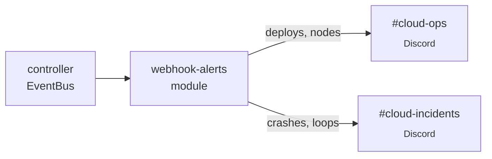

The `webhook-alerts` module subscribes to seven alertable cloud event
types and POSTs JSON payloads to whatever HTTP endpoint you configure
— Discord, Slack, Microsoft Teams, PagerDuty, or your own webhook
receiver. This recipe configures it for a Discord workspace with two
channels: `#cloud-ops` for everything and `#cloud-incidents` for
crashes and crash-loops only.

## What you'll build



Two Discord channels, two webhook configs in the module's Mongo
storage, instant alerts on every event class — no extra infrastructure.

## Prerequisites

- PrexorCloud v1.0+ controller in `production` profile (the module
  uses Mongo storage from `ModuleContext.requireMongoStorage()`).
- A Discord server where you can `Server Settings → Integrations →
  Webhooks → New Webhook` for two channels.
- `prexorctl` v1.0+ logged in with `modules.manage` permission.

## 1. Install the module

```bash
curl -fsSL https://github.com/prexorjustin/prexorcloud/releases/latest/download/webhook-alerts.cosign.bundle.tar -o /tmp/webhook-alerts.tar
prexorctl module install /tmp/webhook-alerts.tar
prexorctl module list
# webhook-alerts   1.0.0   ACTIVE
```

The bundle is Cosign-signed; the controller verifies fail-closed in
production with `modules.signing.required: true`. See
[Internals → Cosign Pipeline](/internals/cosign-pipeline/) for the
trust-root setup.

## 2. Create the two Discord webhooks

In Discord:

1. **#cloud-ops** channel → Edit Channel → Integrations → Webhooks →
   New Webhook → Copy URL. Looks like
   `https://discord.com/api/webhooks/<id>/<token>`.
2. Repeat for **#cloud-incidents**.

Keep the URLs handy — they go in the module config below.

## 3. Configure event routing

The module stores webhook configs in its `webhooks` Mongo collection.
Each config has a `url`, an optional `events` filter (empty = all
events), and is created via the module's REST surface
`/api/v1/modules/webhook-alerts/webhooks`.

Discord expects a payload with a `content` or `embeds` field, but the
module emits its own JSON shape (`{event, timestamp, data}`). Fix this
by pointing each Discord webhook at a small adapter — Cloudflare
Worker, AWS Lambda, or just an `nginx` location that wraps the JSON
in a Discord embed. The simplest is the
[discohook-relay](https://github.com/sammwyy/discohook-relay) recipe
or a 20-line Worker:

```js
// Cloudflare Worker — paste at https://dash.cloudflare.com → Workers
export default {
  async fetch(req, env) {
    const evt = await req.json();
    const color = ({
      instance_crashed: 0xe05a5a,
      crash_loop: 0xb91d1d,
      node_disconnected: 0xff8a3a,
      deployment_completed: 0x4cce8a,
    })[evt.event] ?? 0x9b95ad;

    const body = {
      embeds: [{
        title: evt.event,
        description: '```json\n' + JSON.stringify(evt.data, null, 2) + '\n```',
        timestamp: evt.timestamp,
        color,
      }],
    };

    return fetch(env.DISCORD_URL, {
      method: 'POST',
      headers: { 'Content-Type': 'application/json' },
      body: JSON.stringify(body),
    });
  },
};
```

Set `DISCORD_URL` per Worker (one Worker per channel, or one with a
routing header). Now configure the module to POST to your Worker URL,
not the Discord URL directly:

```bash
TOKEN=$(prexorctl token print --self)
CTRL=$(prexorctl config get controller)

# Channel 1 — #cloud-ops, all events
curl -fsSL -X POST \
  -H "Authorization: Bearer $TOKEN" \
  -H "Content-Type: application/json" \
  -d '{
    "url": "https://prexor-discord.example.workers.dev/cloud-ops",
    "events": []
  }' \
  "$CTRL/api/v1/modules/webhook-alerts/webhooks"

# Channel 2 — #cloud-incidents, crashes only
curl -fsSL -X POST \
  -H "Authorization: Bearer $TOKEN" \
  -H "Content-Type: application/json" \
  -d '{
    "url": "https://prexor-discord.example.workers.dev/cloud-incidents",
    "events": ["instance_crashed", "crash_loop", "node_disconnected"]
  }' \
  "$CTRL/api/v1/modules/webhook-alerts/webhooks"
```

`events: []` means "all events"; otherwise it's an allowlist. The
seven supported wire-names are:

| Wire name | Source event | When it fires |
|---|---|---|
| `node_connected` | `NodeConnectedEvent` | A daemon connects (gRPC stream up). |
| `node_disconnected` | `NodeDisconnectedEvent` | A daemon disconnects with `reason`. |
| `instance_state_changed` | `InstanceStateChangedEvent` | Any state-machine transition. Noisy. |
| `instance_crashed` | `InstanceCrashedEvent` | A non-graceful exit was classified. |
| `crash_loop` | `GroupCrashLoopEvent` | Crash-loop detector tripped on a group. |
| `deployment_created` | `DeploymentCreatedEvent` | A deploy was triggered. |
| `deployment_completed` | `DeploymentCompletedEvent` | A deploy reached `COMPLETED` (or `FAILED`). |

## 4. List configured webhooks

```bash
curl -fsSL -H "Authorization: Bearer $TOKEN" \
  "$CTRL/api/v1/modules/webhook-alerts/webhooks" | jq .
# [
#   { "id": "wh-1", "url": "…/cloud-ops", "events": [] },
#   { "id": "wh-2", "url": "…/cloud-incidents", "events": ["instance_crashed", …] }
# ]
```

To remove one:

```bash
curl -fsSL -X DELETE -H "Authorization: Bearer $TOKEN" \
  "$CTRL/api/v1/modules/webhook-alerts/webhooks/wh-1"
```

## How to verify it works

Force a crash and watch the relevant Discord channel:

```bash
prexorctl instance stop lobby-1 --force --no-graceful
```

Within ~3 seconds, **#cloud-incidents** should show an embed with
`instance_crashed`, the instance ID, exit code, classification, and
group. **#cloud-ops** also receives it (because it subscribes to all).

Trigger a deploy and watch **#cloud-ops** only show
`deployment_created` then `deployment_completed`.

## Common pitfalls

| Symptom | Likely cause |
|---|---|
| Webhooks never fire | Module is `INSTALLED` not `ACTIVE`. Check `prexorctl module list`. |
| Discord returns 400 | You configured the module to POST to Discord directly without the embed adapter. Discord rejects the raw `{event, timestamp, data}` shape. |
| Missing some events | The module subscribes to seven event classes only — `INSTANCE_STATE_CHANGED` is included; per-instance metrics are not. |
| Duplicate alerts | Two webhook configs with overlapping `events` filters. Use the `events` allowlist to deduplicate. |
| Webhook delivery slow | The module uses `httpClient.sendAsync(...)` with a 10s timeout. Slow alerts mean a slow downstream — the controller is not blocked. |

## Where to go next

- [Reference → Module SDK](/reference/module-sdk/) — fork the
  `webhook-alerts` module to add custom event filtering or templating.
- [Guides → Crash Recovery](/guides/crash-recovery/) — what triggers
  the `instance_crashed` and `crash_loop` events.
- [Concepts → Events](/concepts/events/) — every cloud event class,
  including those the module doesn't subscribe to (player journey,
  capability lifecycle, choreography overlays).
