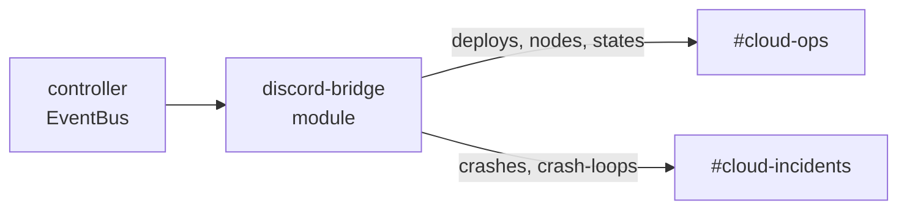

The `discord-bridge` module subscribes to seven alertable controller
events and POSTs them straight to Discord incoming webhooks as rich
embeds. It is a sibling to `webhook-alerts`: same event sources, but
Discord-specific formatting — colour-coded by severity, with structured
fields — instead of a generic JSON body. No relay, adapter, or
Cloudflare Worker is needed; the module speaks the Discord webhook API
directly.

This recipe configures it for one Discord server with two channels:
`#cloud-ops` for every event, and `#cloud-incidents` for crashes and
crash-loops only.

## What you'll build



Two Discord channels, two target documents in the module's Mongo
collection, embeds on every event class. The module is outbound only:
controller events flow to Discord. Discord slash-commands and
in-game-chat bridging are not part of this module.

## Before you start

- A PrexorCloud controller running in the `production` profile. The
  module declares `storage.mongo: true` in its manifest, so the
  controller must have Mongo configured (the compose deployment in
  `deploy/compose/` already does — service `mongo`, database
  `prexorcloud`).
- `prexorctl` logged in to that controller (`prexorctl login`).
- A Discord server where you can create incoming webhooks
  (**Server Settings → Integrations → Webhooks**, or per-channel
  **Edit Channel → Integrations → Webhooks**).
- `mongosh` access to the controller's Mongo, or the ability to
  `docker compose exec mongo mongosh`. Targets are written directly to
  the module's collection — see the note in step 3.

## 1. Install the module

The module ships as a signed jar (or a `.tar` bundle pairing the jar
with its `.cosign.bundle` sidecar). `prexorctl module install` uploads
the jar and its signature so the controller verifies the signature
before installing.

```bash
prexorctl module install /tmp/discord-bridge.tar
# ✓ Module "discord-bridge" installed (signature: discord-bridge.cosign.bundle)
```

You can also install from a configured registry by id:

```bash
prexorctl module install discord-bridge@1.0.0
```

Confirm it loaded:

```bash
prexorctl module list
```

```text
NAME             ENABLED   FRONTEND   PLUGINS
discord-bridge   ENABLED   no         0
```

If `ENABLED` shows `DISABLED`, the module is installed but not running —
its event subscriptions are inactive and nothing will be delivered.

## 2. Create the two Discord webhooks

In Discord, create one incoming webhook per channel and copy its URL.

1. **#cloud-ops** → Edit Channel → Integrations → Webhooks → New Webhook
   → Copy Webhook URL. The URL has the form
   `https://discord.com/api/webhooks/<id>/<token>`.
2. Repeat for **#cloud-incidents**.

Keep both URLs; they go straight into the target documents below. The
module POSTs the embed payload to these URLs as-is — no intermediate
service.

## 3. Configure targets

The module reads its targets from a Mongo collection on every event. A
target is a small document:

```json
{
  "url": "https://discord.com/api/webhooks/<id>/<token>",
  "username": "PrexorCloud",
  "events": []
}
```

- `url` — the Discord incoming-webhook URL. Required.
- `username` — optional override for the embed's displayed sender name.
  Omit or leave empty to use the webhook's configured name.
- `events` — an allowlist of wire names. An **empty list means all
  events**; otherwise only the listed events fire to this target.

> **Where targets live.** The `discord-bridge` module does not expose a
> REST or CLI surface for managing targets — it only reads them. The
> controller allocates each platform module an isolated Mongo collection
> namespace `platform_<sanitized-id>_`, where the id is lowercased and
> any character outside `[a-z0-9_]` becomes `_`. For id `discord-bridge`
> the prefix is `platform_discord_bridge_`, and the target collection is
> **`platform_discord_bridge_discord_targets`** in the controller's
> database (`prexorcloud` by default). Insert targets there directly.

Open a shell against the controller's Mongo. With the compose
deployment:

```bash
docker compose exec mongo mongosh prexorcloud
```

Insert the two targets. Replace the placeholder URLs with the ones you
copied in step 2:

```javascript
db.platform_discord_bridge_discord_targets.insertMany([
  {
    url: "https://discord.com/api/webhooks/AAAA/ops-token",
    username: "PrexorCloud",
    events: []
  },
  {
    url: "https://discord.com/api/webhooks/BBBB/incidents-token",
    username: "PrexorCloud",
    events: ["instance_crashed", "crash_loop"]
  }
])
```

`#cloud-ops` has `events: []`, so it receives every event class.
`#cloud-incidents` lists only `instance_crashed` and `crash_loop`, so it
receives those two and nothing else.

Changes take effect on the next event — the module re-reads its targets
each time it fires, so there is no reload step. Targets are sorted by
`url` when read.

## Event types and embeds

The module maps these seven event classes to stable wire names (the same
names `webhook-alerts` uses, so an `events` allowlist is portable
between the two modules):

| Wire name | Source event | When it fires | Embed colour |
|---|---|---|---|
| `node_connected` | `NodeConnectedEvent` | A daemon's gRPC stream comes up. | Green |
| `node_disconnected` | `NodeDisconnectedEvent` | A daemon disconnects, with a `reason`. | Orange |
| `instance_state_changed` | `InstanceStateChangedEvent` | Any instance state-machine transition. Noisy. | Blurple |
| `instance_crashed` | `InstanceCrashedEvent` | A non-graceful exit was classified. | Red |
| `crash_loop` | `GroupCrashLoopEvent` | The crash-loop detector tripped on a group. | Dark red |
| `deployment_created` | `DeploymentCreatedEvent` | A deploy was triggered ("Deployment started"). | Blurple |
| `deployment_completed` | `DeploymentCompletedEvent` | A deploy reached its outcome. | Green |

Each embed carries a title, the severity colour, a UTC `timestamp`, and
inline fields drawn from the event:

| Wire name | Embed fields |
|---|---|
| `node_connected` | Node, Session |
| `node_disconnected` | Node, Reason |
| `instance_state_changed` | Instance, Group, Node, Transition (`OLD → NEW`) |
| `instance_crashed` | Instance, Group, Node, Exit code, Classification |
| `crash_loop` | Group, Crashes, Window start |
| `deployment_created` | Group, Revision, Strategy |
| `deployment_completed` | Group, Revision, Outcome |

The embed colours are fixed in the module (`DiscordEmbeds`): green for
healthy transitions and completed deploys, red for crashes, dark red for
crash-loops, orange for disconnects, blurple for routine activity.

`instance_state_changed` fires on every transition and is the noisiest
of the seven. Leave it out of an `events` allowlist unless you want a
running play-by-play.

## 4. Verify delivery

Trigger a deploy and watch `#cloud-ops`. You should see a blurple
**Deployment started** embed, then a green **Deployment completed**
embed once it finishes — each with the group, revision, and
strategy/outcome.

To exercise the incident path, cause a crash on a test group and watch
**both** channels: `#cloud-incidents` (because it allowlists
`instance_crashed`) and `#cloud-ops` (because its empty `events` list
matches everything). The embed shows the instance id, group, node, exit
code, and classification.

If embeds do not appear, check the controller log. The module logs a
`WARN` per failure with the target URL:

```text
WARN  module:discord-bridge - Discord webhook https://discord.com/api/webhooks/… returned status 404
```

A `404` means the webhook was deleted in Discord; a `401`/`403` means a
bad token in the URL.

## Delivery behaviour

- **Asynchronous, non-blocking.** Each target is POSTed via
  `httpClient.sendAsync(...)` with a 10-second timeout. A slow or
  unreachable Discord endpoint does not block the controller or delay
  other targets.
- **Fire-and-forget.** The response body is discarded; there are no
  retries. A transient Discord outage drops those embeds. The failure is
  logged at `WARN`, never raised to the event source.
- **Per-event re-read.** Targets are read fresh on every event, so
  inserts and deletes apply immediately with no restart.
- **`User-Agent`.** The module sends `PrexorCloud-DiscordBridge/1.0`.

## Common pitfalls

| Symptom | Likely cause |
|---|---|
| No embeds at all | Module shows `DISABLED` in `prexorctl module list` — its subscriptions aren't active. |
| No embeds, no log lines | No documents in `platform_discord_bridge_discord_targets`, or they're in the wrong collection (check the prefix: `platform_discord_bridge_`, not `mod_…`). |
| `WARN … returned status 404` | The Discord webhook was deleted; recreate it and update the `url`. |
| One channel gets everything, the other nothing | `events: []` is an allowlist-of-all, not an empty allowlist. Use a non-empty list to scope a target. |
| Too much noise | `instance_state_changed` is in an `events` list (or the list is empty). Remove it. |
| Wanted slash-commands / chat bridge | Out of scope. This module is a one-way webhook poster; a gateway-bot bridge is a separate effort. |

## webhook-alerts vs discord-bridge

Both modules subscribe to the same seven events and share the wire
names. They differ in payload shape and destination:

- `discord-bridge` POSTs a Discord embed payload
  (`{username?, embeds:[…]}`) and is meant for Discord webhook URLs.
  Collection: `platform_discord_bridge_discord_targets`.
- `webhook-alerts` POSTs a generic `{event, timestamp, data}` JSON body
  to any HTTP endpoint (your own receiver, a serverless function, a
  non-Discord sink). Collection: `platform_webhook_alerts_webhooks`.

Use `discord-bridge` for Discord; use `webhook-alerts` when you control
the receiver or are integrating a non-Discord sink.

## Where to go next

- [Reference → Module SDK](/reference/module-sdk/) — fork
  `discord-bridge` to add custom titles, fields, or filtering.
- [Concepts → Events](/concepts/events/) — every controller event
  class, including those these modules don't subscribe to.
