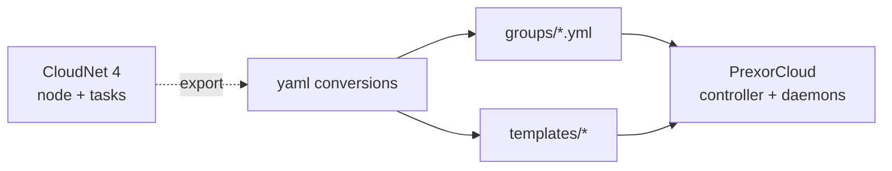

CloudNet 4 and PrexorCloud are both Minecraft cloud orchestrators with
overlapping concepts: tasks ↔ groups, services ↔ instances,
node-network ↔ daemon set. The shapes are similar enough that
migration is mostly mechanical — convert task definitions to group
configs, copy the templates, repoint the proxy, drop CloudNet's
modules in favour of PrexorCloud's first-party equivalents (or port
them as platform modules). This recipe walks one full-network
migration end-to-end.

## What you'll build



End state: every task running under CloudNet 4 maps to a PrexorCloud
group; every CloudNet template directory becomes a PrexorCloud
template; the Velocity/Bungee proxy points at PrexorCloud; CloudNet 4
is decommissioned.

## Prerequisites

- A working CloudNet 4 install. Tested with v4.0.x.
- A working PrexorCloud v1.0+ controller (use the
  [Quickstart](/getting-started/quickstart/)) with at least one
  daemon node.
- Network connectivity from operators' laptops to both controllers.
- A maintenance window of ~30 minutes per game-mode (proxy hand-off
  is the only player-visible interruption).

## 1. Concept mapping

Most of CloudNet's vocabulary has a one-line PrexorCloud equivalent:

| CloudNet 4 term | PrexorCloud term | Notes |
|---|---|---|
| **Node** | **Daemon node** | One process per host. Both register against a controller; PrexorCloud uses mTLS, CloudNet uses shared secret. |
| **Task** | **Group** | The reusable launch spec: platform, jar, environment, port range, scaling. |
| **Service** | **Instance** | A running JVM under a task/group. Same lifecycle FSM (`PREPARING → STARTING → RUNNING → STOPPING`). |
| **Template** | **Template (layered)** | CloudNet picks one global template per task; PrexorCloud composes a chain (`base → base-{platform} → group → user`). |
| **Group (CloudNet)** | **Template + label**, no equivalent record | CloudNet "groups" are template inheritance + tagging. In PrexorCloud, that's the template chain plus daemon labels. |
| **Cluster (multi-node)** | **Multi-controller HA** | CloudNet has a head-node + worker model; PrexorCloud is active-active with Valkey-backed leases. |
| **Module (CloudNet)** | **Platform module** | Java jar loaded at controller runtime. PrexorCloud modules use `cloud-api` only and link via capabilities. |
| **CloudNet REST module** | Built-in REST | PrexorCloud ships REST + SSE + dashboard out of the box; no add-on. |
| **`smart` module** | Built-in DYNAMIC scaler | PrexorCloud's scaler is first-class; see [Concepts → Scheduling and Scaling](/concepts/scheduling-and-scaling/). |
| **`bridge` module** | Built-in proxy plugin + Network Composition | PrexorCloud ships proxy plugins for Velocity/Bungee with topology routing baked in — no module install. |
| **`signs` module** | Out of v1 scope | Drop the module; lobby-side joinable-signs is a community plugin concern in PrexorCloud. |
| **`labymod` module** | Player-side plugin | Same plugin works; install in template. |
| **`syncproxy` module** | Network Composition | One Velocity proxy can front everything; multiple proxies coordinate via the controller's `NetworkComposition`. |
| **`syncproxy` MOTD/maintenance** | Group `maintenance` flag + Network Composition `motd` | Set per-group via `prexorctl group maintenance <g> on`. |

What is **not** in the box and you'd have to write yourself:

- **`signs` equivalent** — joinable signs that show service status. The
  controller exposes the data via SSE; a thin server-plugin reads the
  `prexor-plugin` events and updates signs. Pattern works but no
  first-party module ships.
- **`storage-ftp` / `storage-mysql`** — PrexorCloud stores templates in
  Mongo (content-hashed), not in a separate object store. If your
  CloudNet config sources templates from FTP, you'll re-push them
  with `prexorctl template push`.

## 2. Pick a sequencing strategy

You have two options:

- **Big bang.** Take a maintenance window, stop CloudNet, migrate
  everything, switch DNS. Simpler but disruptive.
- **Side-by-side.** Stand up PrexorCloud alongside CloudNet on a
  different port range, migrate one game-mode at a time, shift
  traffic via two A records or a load balancer. Less risky for big
  networks.

The steps below describe big bang. Side-by-side is identical except
you keep both running and shift game-modes as DNS allows.

## 3. Convert tasks to group configs

Each CloudNet task lives at `local/tasks/<name>/task.json`. A typical
file looks like:

```json
{
  "name": "lobby",
  "runtime": "jvm",
  "associatedNodes": [],
  "groups": ["Global-Server", "Lobby"],
  "minServiceCount": 2,
  "maxServiceCount": 4,
  "startPort": 41000,
  "processConfiguration": {
    "environment": "minecraft_server",
    "maxHeapMemorySize": 1024,
    "jvmOptions": ["-XX:+UseG1GC"]
  },
  "templates": [{ "prefix": "Lobby", "name": "default", "alwaysCopyToStaticServices": false }]
}
```

The PrexorCloud equivalent (`groups/lobby.yml`):

```yaml
name: lobby
platform: paper
version: "1.21.4"             # CloudNet's `environment`/`startPort` + your jar choice
scaling: { mode: STATIC, min: 2, max: 4 }
ports: { from: 41000, to: 41099 }
resources:
  memoryMB: 1024
  jvmArgs: ["-XX:+UseG1GC"]
templates: [base-paper, lobby]
```

Replicate per task. If you used CloudNet's `smart` module for
auto-scaling:

```json
"smartConfig": { "enabled": true, "minServiceCount": 1, "autoStopTimeByUnusedServiceInSeconds": 180 }
```

becomes:

```yaml
scaling:
  mode: DYNAMIC
  metric: players
  target: 0.7
  min: 1
  max: 8
  cooldownSeconds: 60
  scaleDownAt: 0.2
```

Apply all groups at once:

```bash
prexorctl group apply -f groups/
```

## 4. Convert templates

CloudNet templates live at `local/templates/<prefix>/<name>/`. Each
contains `cloud-plugins/`, `world/`, `server.properties`, etc.

PrexorCloud templates are the same on-disk shape but pushed to the
controller's content-addressed store:

```bash
# CloudNet: local/templates/Lobby/default/  →  PrexorCloud: templates/lobby/
cp -r /opt/cloudnet/local/templates/Lobby/default templates/lobby
prexorctl template push templates/lobby/
```

A few CloudNet conventions are different in PrexorCloud:

- **Template inheritance.** CloudNet uses a flat list with copy-on-
  start; PrexorCloud composes a chain (`base → base-paper → group →
  user`) and the daemon materialises in order. Move shared files into
  a `base-paper` template once, reference it from each group.
- **Inclusion paths.** CloudNet's `inclusions` (URL downloads) become
  template files. Pre-fetch and commit them; PrexorCloud's daemon
  doesn't fetch from the open internet at start time.
- **Dynamic plugin variables.** CloudNet's `placeholders` substitution
  (`%name%`, `%task%`) becomes PrexorCloud's environment-variable
  injection. Set vars per-group in `env:` and reference them as
  `${VAR}` in plugin configs.

## 5. Repoint the proxy

In CloudNet, Velocity is a service running the `bridge` plugin. In
PrexorCloud, Velocity is a group with the bundled cloud-plugin and a
Network Composition record:

```yaml
# proxy.yml
name: proxy
platform: velocity
version: "3.4.0"
scaling: { mode: STATIC, min: 1, max: 1 }
ports: { from: 25565, to: 25565 }
exposeOnHost: true
```

```yaml
# network.yml
name: main
proxyGroup: proxy
lobbyGroup: lobby
fallbackGroups: [lobby]
gameGroups: [bedwars, skywars]
```

```bash
prexorctl group apply -f groups/proxy.yml
prexorctl network apply -f network.yml
```

The proxy plugin walks `[lobbyGroup] ++ fallbackGroups` on connect and
fallback chain on kick — replacing CloudNet's `bridge` config + per-
proxy `velocity.toml` overrides with one record. See
[Your First Network](/getting-started/your-first-network/).

## 6. Decommission CloudNet

When traffic is on the new proxy and groups are healthy:

```bash
# CloudNet head node
sudo systemctl stop cloudnet
sudo systemctl disable cloudnet
```

Keep the CloudNet install for two weeks as a rollback option. Audit
trail of player connects pre-cutover lives in CloudNet's `auditlog`
plugin; PrexorCloud's audit log starts fresh on cutover.

## How to verify it works

```bash
# Every group from your tasks is present
prexorctl group list

# Every template is pushed
prexorctl template list

# Proxy is running and Network Composition is applied
prexorctl network list
prexorctl instance describe proxy-1

# Audit log shows the cutover apply commands
prexorctl audit query --since "1 hour ago" --filter group.apply
```

Connect a Minecraft client to the new proxy. `/server <name>` and
`/play <group>` should behave as before — the routing layer is just
PrexorCloud now.

## Common pitfalls

| Symptom | Likely cause |
|---|---|
| Players see the wrong MOTD | CloudNet's `syncproxy` motd is now `network.motd` in `network.yml`. Update and re-apply. |
| Templates contain `%task%` placeholders unresolved | PrexorCloud doesn't substitute the same set. Replace with `${PREXOR_GROUP}` (env-injected) and re-push. |
| Modules don't load | CloudNet modules use a different SDK. They won't load as platform modules; rewrite against `cloud-api`. See [Reference → Module SDK](/reference/module-sdk/). |
| Velocity rejects connections | `proxy-protocol` mismatch. CloudNet defaults differ; see [Recipes → Reverse Proxy](/recipes/reverse-proxy/) for the right `velocity.toml` flags. |

## Where to go next

- [Compare → CloudNet 4](/compare/cloudnet-4/) — feature-by-feature
  comparison, written for "should I migrate at all?" decisions.
- [Concepts → Architecture](/concepts/architecture/) — the controller/
  daemon split that differs from CloudNet's head-node model.
- [Guides → HA Controller (Redis)](/guides/ha-controller/) —
  PrexorCloud's HA shape vs CloudNet's cluster mode.
