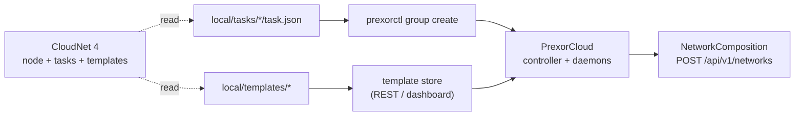

CloudNet 4 and PrexorCloud are both Minecraft cloud orchestrators, and most
of CloudNet's vocabulary has a direct PrexorCloud counterpart: tasks become
groups, services become instances, the node network becomes the
controller/daemon set, and the `bridge`/`syncproxy` proxy stack becomes the
bundled proxy plugin plus a Network composition. The shapes line up closely
enough that the migration is mostly translation — read your `task.json`
files, recreate each as a group, copy the template files into PrexorCloud's
template store, and repoint the proxy. The two genuine rewrites are
CloudNet modules (a different SDK) and anything that relied on CloudNet's
template inclusions fetching from the internet at start time.

This recipe walks one full network from a running CloudNet 4 install to
PrexorCloud, then decommissions CloudNet. For the decision question —
*should* you migrate — read [Compare → CloudNet 4](/compare/cloudnet-4/)
first; this page assumes you already decided yes.

## What you'll do



End state: every CloudNet task maps to a PrexorCloud group; every CloudNet
template directory lives in PrexorCloud's content-addressed template store;
the Velocity or BungeeCord proxy routes through PrexorCloud's Network
composition; CloudNet 4 is stopped and kept only as a rollback option.

## Before you start

- A working CloudNet 4 install you can read files from. Tested against
  v4.0.x; the `task.json` shape has been stable across 4.0 point releases.
- A PrexorCloud v1.0+ controller with at least one daemon node `READY` in
  `prexorctl node list`. If you don't have one, follow the
  [Quickstart](/getting-started/quickstart/).
- `prexorctl login` succeeds and `prexorctl status` shows the controller.
- Your CLI token has the `groups.create`, `templates.create`, and
  `networks` permissions (the default admin role has all three).
- A maintenance window per game-mode of roughly 30 minutes. The only
  player-visible interruption is the proxy hand-off.

## 1. Map the concepts

Most CloudNet terms have a one-line PrexorCloud equivalent. The glossary
below is what you'll reach for while reading `task.json` files.

| CloudNet 4 | PrexorCloud | Notes |
|---|---|---|
| Node | Daemon node | One agent process per host, registered to a controller. PrexorCloud uses mTLS between controller and daemon; CloudNet uses a shared cluster secret. |
| Task | Group | The reusable launch spec: platform, version, port range, scaling bounds, templates. |
| Service | Instance | A running JVM under a task/group. PrexorCloud's lifecycle is `PREPARING → STARTING → RUNNING → DRAINING → STOPPING → STOPPED`. |
| Template | Template layer | CloudNet copies a flat list of templates onto each service; PrexorCloud composes an ordered chain `base → base-{platform} → {group} → {user templates}`. |
| Group (CloudNet) | Template layer + group fields | CloudNet "groups" are shared template inheritance plus tags. In PrexorCloud that's a shared template layer (for example `base-paper`) referenced from each group's `templates`. |
| Cluster (head + workers) | Multi-controller HA | CloudNet has a head node and worker nodes. PrexorCloud runs active-active controllers backed by a Ratis Raft control plane. See [Concepts → Cluster model](/concepts/cluster-model/). |
| Module (CloudNet) | Module *or* plugin | CloudNet has one extension type loaded into the node. PrexorCloud splits this: a **module** extends the controller via the Capability API; a **plugin** runs inside the Minecraft server/proxy. See [Concepts → Modules](/concepts/modules/) and [Concepts → Plugins](/concepts/plugins/). |
| `rest` module | Built-in REST + dashboard | PrexorCloud ships the REST API, SSE event stream, and dashboard in the controller. Nothing to install. |
| `bridge` module | Bundled proxy plugin | PrexorCloud bundles the cloud plugin into the proxy template's `base-{platform}` layer. Player routing is driven by `NetworkComposition`, not a `bridge` config. |
| `syncproxy` module | Network composition + group MOTD | Cross-proxy MOTD and maintenance: per-proxy behaviour comes from the `NetworkComposition` that targets a proxy group; MOTD and maintenance are group fields (`motds`, `maintenance`). |
| `smart` module | Built-in `DYNAMIC` scaling | The scaler is part of the controller. Set `scalingMode: DYNAMIC` and tune `scaleUpThreshold` / `scaleDownAfterSeconds`. See [Concepts → Scheduling and scaling](/concepts/scheduling-and-scaling/). |
| `signs` module | Not first-party | No bundled joinable-signs module ships in v1. The connect/disconnect data is on the SSE stream; a small server plugin can drive signs from it, but you write that plugin. |
| `labymod` module | Player-side plugin | The LabyMod server plugin works unchanged. Drop the jar into a template layer. |
| `storage-ftp` / `storage-mysql` | Content-addressed template store | PrexorCloud stores template files itself, SHA-256-versioned. There is no external object store to configure; you re-upload the files once. |

What you must build yourself if you relied on it in CloudNet:

- **A `signs` replacement.** No first-party module. The connect data is on
  the controller's SSE stream; a thin server plugin can read it and update
  signs, but no jar ships for this.
- **Internet-fetched template inclusions.** CloudNet's template
  `inclusions` download from URLs at service start. PrexorCloud's daemon
  does not fetch from the open internet when materialising an instance.
  Pre-fetch those files and upload them into the template instead.

## 2. Choose a sequencing strategy

You have two options:

- **Big bang.** Take one window, stop CloudNet, migrate everything, switch
  DNS to the new proxy. Simpler, more disruptive.
- **Side-by-side.** Stand PrexorCloud up on a different port range, migrate
  one game-mode at a time, and shift traffic with two A records or a load
  balancer in front of both proxies. Lower risk for large networks.

The steps below describe **big bang**. Side-by-side is identical except you
leave CloudNet running and move game-modes across as DNS allows.

## 3. Read each task and recreate it as a group

A CloudNet task lives at `local/tasks/<name>/task.json`. A typical lobby
task:

```json
{
  "name": "lobby",
  "runtime": "jvm",
  "minServiceCount": 2,
  "maxServiceCount": 4,
  "startPort": 41000,
  "groups": ["Global-Server", "Lobby"],
  "processConfiguration": {
    "environment": "minecraft_server",
    "maxHeapMemorySize": 1024,
    "jvmOptions": ["-XX:+UseG1GC"]
  },
  "templates": [
    { "prefix": "Global", "name": "default" },
    { "prefix": "Lobby", "name": "default" }
  ]
}
```

PrexorCloud groups are created with `prexorctl group create` and flags. The
flags map onto the controller's group config (`groups/<name>.yml` on the
controller, stored as a `GroupConfig`). The table below shows the
translation; fields with no flag are set on the resulting YAML or left at
their defaults.

| CloudNet `task.json` | PrexorCloud flag / field | Notes |
|---|---|---|
| `name` | `--name` | Same value. |
| `processConfiguration.environment` | `--platform` | `minecraft_server` → `paper` (or `folia`); a proxy env → `velocity` / `bungeecord`. PrexorCloud chooses the jar from its catalog; CloudNet's environment string does not carry the exact build. |
| (jar version) | `--platform-version` | The catalog version to provision, for example `1.21.4`. CloudNet pins this in the template; here it's explicit. |
| `minServiceCount` | `--min` | Lower instance bound. |
| `maxServiceCount` | `--max` | Upper instance bound. |
| `startPort` | `--port-start` | The bottom of the daemon-side port range. |
| (derived) | `--port-end` | CloudNet allocates upward from `startPort`; set an end that leaves room, for example `start + 99`. |
| `processConfiguration.maxHeapMemorySize` | `--memory` | Megabytes per instance. |
| `smartConfig` present | `--scaling-mode DYNAMIC` | See step 4. Without `smart`, use `STATIC`. |
| `templates[]` | `--template` (repeatable, ordered) | One `--template` per layer, in apply order. The group's own layer (named after the group) is applied automatically before these. |
| `processConfiguration.jvmOptions` | `jvmArgs` in `groups/<name>.yml` | No create flag; set it on the YAML or via `PATCH /api/v1/groups/<name>`. |

The lobby task above becomes:

```bash
prexorctl group create \
    --name lobby \
    --platform paper \
    --platform-version 1.21.4 \
    --scaling-mode STATIC \
    --min 2 --max 4 \
    --port-start 41000 --port-end 41099 \
    --memory 1024 \
    --template base-paper \
    --template lobby
```

Repeat once per task. Confirm they all landed:

```bash
prexorctl group list
```

`jvmOptions` has no create flag. Set `jvmArgs` afterward by editing
`groups/lobby.yml` on the controller, or with a JSON patch:

```bash
curl -sS -X PATCH https://<host>:8080/api/v1/groups/lobby \
    -H "Authorization: Bearer $PREXOR_TOKEN" \
    -H "Content-Type: application/json" \
    -d '{ "jvmArgs": ["-XX:+UseG1GC"] }'
```

### CloudNet's two "group" concepts

CloudNet tasks reference shared **groups** (the `"groups"` array, here
`Global-Server` and `Lobby`) whose only job is to pull in shared template
files and apply shared properties. PrexorCloud has no separate group-tag
record for this. Recreate the shared bits as a **template layer** (for
example `base-paper` or `global`) and list it in each group's
`--template` chain. Files in a later layer overwrite files of the same path
from an earlier layer; directories union. That gives you CloudNet's
inheritance with explicit, ordered layers instead of an implicit merge.

## 4. Translate `smart` auto-scaling

If a task used the `smart` module:

```json
"smartConfig": {
  "enabled": true,
  "minServiceCount": 1,
  "maxServiceCount": 8,
  "percentOfPlayersToCheckShouldStopTheService": 0,
  "autoStopTimeByUnusedServiceInSeconds": 180
}
```

Set the group to `DYNAMIC` and tune the scaler. PrexorCloud's `DYNAMIC`
mode scales up when player load crosses `scaleUpThreshold` (a fraction of
`maxPlayers`) and scales down after `scaleDownAfterSeconds` of idle, both
respecting `scaleCooldownSeconds`:

```bash
prexorctl group create \
    --name bedwars \
    --platform paper \
    --platform-version 1.21.4 \
    --scaling-mode DYNAMIC \
    --min 1 --max 8 \
    --port-start 41800 --port-end 41899 \
    --memory 2048 \
    --template base-paper \
    --template bedwars
```

`scaleUpThreshold` (default `0.8`), `scaleDownAfterSeconds` (default `300`),
and `scaleCooldownSeconds` (default `60`) have no create flags. Set them on
`groups/bedwars.yml` or with a `PATCH`. CloudNet's
`autoStopTimeByUnusedServiceInSeconds` maps onto `scaleDownAfterSeconds`.
There is no direct equivalent of
`percentOfPlayersToCheckShouldStopTheService`; PrexorCloud scales on the
single `scaleUpThreshold` fraction. For the full scaler model, read
[Concepts → Scheduling and scaling](/concepts/scheduling-and-scaling/).

## 5. Move the templates

CloudNet templates live at `local/templates/<prefix>/<name>/`. Each is a
file tree: `plugins/`, `world/`, `server.properties`, config files. The
on-disk shape is the same in PrexorCloud — the difference is where the
files live and how layers compose.

PrexorCloud stores template files in a content-addressed store on the
controller, SHA-256-versioned. There is **no CLI upload command**:
`prexorctl template` only lists, shows version history, and rolls back
(`template list`, `template versions <name>`, `template rollback <name>`).
Create templates and upload files through the dashboard's template editor
or the REST API:

- Create a template: `POST /api/v1/templates` with a `TemplateConfig` body.
- Upload files: `POST /api/v1/templates/{name}/files/upload`.

Example: create a `lobby` template and upload the CloudNet `Lobby/default`
tree into it.

```bash
# Create the template
curl -sS -X POST https://<host>:8080/api/v1/templates \
    -H "Authorization: Bearer $PREXOR_TOKEN" \
    -H "Content-Type: application/json" \
    -d '{ "name": "lobby" }'

# Upload each file from the CloudNet template dir
cd /opt/cloudnet/local/templates/Lobby/default
find . -type f | while read -r f; do
  curl -sS -X POST "https://<host>:8080/api/v1/templates/lobby/files/upload?path=${f#./}" \
    -H "Authorization: Bearer $PREXOR_TOKEN" \
    -F "file=@${f}"
done
```

The dashboard's template editor is the friendlier path for a one-time
migration: create the template, then drag the directory in.

Three CloudNet conventions change here:

- **Layering instead of a flat copy.** CloudNet copies its template list
  onto every service. PrexorCloud composes an ordered chain
  `base → base-{platform} → {group} → {user templates}` and the daemon
  unpacks each layer in order, later layers overwriting earlier ones by
  path. Put files shared across game-modes into one layer (`base-paper`)
  and reference it from each group's `--template` chain — don't duplicate
  them per template.
- **Inclusions become files.** CloudNet's `inclusions` download plugins or
  worlds from URLs at service start. The daemon does not fetch from the
  open internet at materialisation time. Pre-fetch those files and upload
  them into the template.
- **Placeholders become environment variables.** CloudNet substitutes
  `%name%`, `%task%`, and similar at deploy time. PrexorCloud injects
  per-instance environment variables (set in the group's `env` map) and
  applies `configPatches`; reference variables as `${VAR}` in config files.
  Replace CloudNet's placeholder tokens accordingly. See
  [Concepts → Groups, instances, templates](/concepts/groups-instances-templates/)
  for the substitution and patch order.

A layer named in a `--template` chain but missing from the store is logged
and skipped — it does not fail the plan. Upload the files before you start
instances so nothing is silently absent.

## 6. Repoint the proxy

In CloudNet, the proxy is a service running the `bridge` plugin, configured
by `bridge`/`syncproxy` config files. In PrexorCloud, the proxy is a group
on a proxy platform — the cloud plugin is already bundled into its
`base-{platform}` layer — and routing comes from a `NetworkComposition`.

Create the proxy group:

```bash
prexorctl group create \
    --name proxy \
    --platform velocity \
    --platform-version 3.4.0 \
    --scaling-mode STATIC \
    --min 1 --max 1 \
    --port-start 25565 --port-end 25565 \
    --memory 512
```

Keep the proxy `STATIC` with `--min 1 --max 1` for a single entrypoint.

Networks have **no `prexorctl` subcommand**. Create the composition through
the REST API at `/api/v1/networks` (or the dashboard's network editor). The
body is a `NetworkComposition`:

| Field | Type | Meaning |
|---|---|---|
| `name` | string | Composition name. |
| `lobbyGroup` | string | Default join target and last-resort fallback. Must be an existing group. |
| `fallbackGroups` | string[] | Ordered fallback chain tried after the lobby on a kick. May be empty. |
| `memberGroups` | string[] | Backend groups in this network. Empty means no restriction. |
| `proxyGroups` | string[] | Proxy groups this composition applies to. Empty means all proxies. |
| `kickMessage` | string | Shown when every fallback is exhausted. Optional. |
| `bedrockLobbyGroup` | string | Join target for Bedrock players. Blank means use `lobbyGroup`. |
| `bedrockFallbackGroups` | string[] | Bedrock-specific fallback chain. Empty means use `fallbackGroups`. |

```bash
curl -sS -X POST https://<host>:8080/api/v1/networks \
    -H "Authorization: Bearer $PREXOR_TOKEN" \
    -H "Content-Type: application/json" \
    -d '{
        "name": "main",
        "lobbyGroup": "lobby",
        "fallbackGroups": ["lobby"],
        "memberGroups": ["lobby", "bedwars", "skywars"],
        "proxyGroups": ["proxy"],
        "kickMessage": "All lobbies are full — try again shortly."
    }'
```

On a normal join the proxy plugin builds the chain
`[lobbyGroup] ++ fallbackGroups`, drops duplicates, and connects to the
first `RUNNING` instance. On a kick it builds the same chain but excludes
the group the player was kicked from. This replaces CloudNet's `bridge`
config plus per-proxy `velocity.toml` overrides with one record. The
controller validates every referenced group when you create the
composition, so create the groups first. See
[Getting started → Your first network](/getting-started/your-first-network/)
for the full routing model.

The proxy is the only player-visible cutover. Once it's running and the
composition is applied, switch DNS to it.

## 7. Decommission CloudNet

When players are on the new proxy and every group is healthy:

```bash
sudo systemctl stop cloudnet
sudo systemctl disable cloudnet
```

Keep the CloudNet install for about two weeks as a rollback option. Its
audit history stays in CloudNet; PrexorCloud's audit log starts fresh at
cutover. See [Operations → Logs and audit](/operations/logs-and-audit/) for
where the new log lives.

## Verify it works

```bash
# Every task is now a group
prexorctl group list

# Every template you uploaded is present
prexorctl template list

# The proxy is running
prexorctl instance list --group proxy
prexorctl instance info proxy-1
```

Check the network composition over REST:

```bash
curl -sS https://<host>:8080/api/v1/networks \
    -H "Authorization: Bearer $PREXOR_TOKEN"
```

Then connect a Minecraft client to the new proxy. The first join should
land on a lobby instance; `/server <name>` should switch backends as
before. The routing layer is now PrexorCloud.

## Common pitfalls

| Symptom | Likely cause and fix |
|---|---|
| Instances never reach `RUNNING`; logs say a template was skipped | A `--template` layer name has no files in the store. Upload the files (step 5) before starting instances. |
| A plugin config still contains `%task%` or `%name%` | CloudNet placeholders aren't substituted. Set the value in the group's `env` map and reference it as `${VAR}`, or bake it into the template. |
| A CloudNet module won't load | CloudNet modules use a different SDK and don't load on PrexorCloud. Decide whether the behaviour belongs in the controller (a module against the Capability API) or in the server/proxy (a plugin), then rewrite it. See [Reference → Module SDK](/reference/module-sdk/) and [Reference → Plugin SDK](/reference/plugin-sdk/). |
| The proxy rejects backend connections | `proxy-protocol` / forwarding mismatch between proxy and backend. See [Recipes → Reverse proxy](/recipes/reverse-proxy/) for the correct settings. |
| `POST /api/v1/networks` returns a validation error | A referenced group (`lobbyGroup`, a `fallbackGroups` entry, or a `proxyGroups` entry) doesn't exist yet. Create all groups first, then the composition. |
| A `signs`-based lobby shows no servers | No first-party signs module ships. Drive signs from the SSE stream with a server plugin, or drop the feature. |

## Where to go next

- [Compare → CloudNet 4](/compare/cloudnet-4/) — feature-by-feature, for
  the "should I migrate at all?" decision.
- [Getting started → Your first network](/getting-started/your-first-network/) —
  the canonical group + Network composition walkthrough.
- [Concepts → Scheduling and scaling](/concepts/scheduling-and-scaling/) —
  the `DYNAMIC` scaler you mapped `smart` onto.
- [Concepts → Modules](/concepts/modules/) and
  [Concepts → Plugins](/concepts/plugins/) — the module/plugin split that
  replaces CloudNet's single module type.
- [Concepts → Cluster model](/concepts/cluster-model/) — PrexorCloud's HA
  shape versus CloudNet's head-node cluster.
