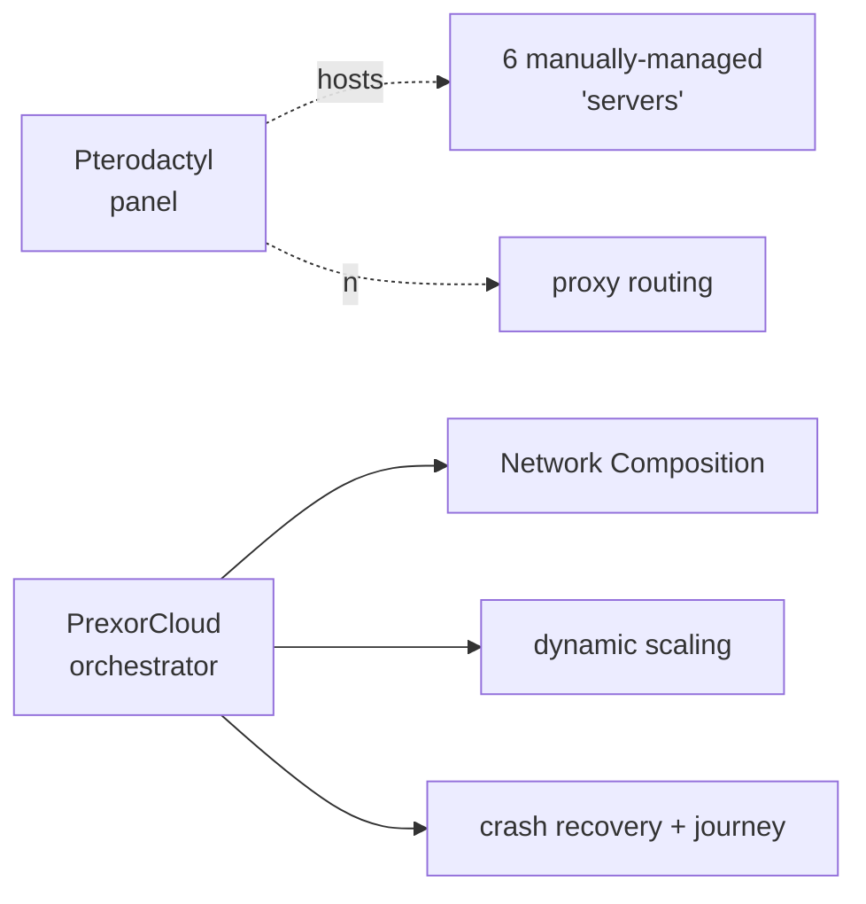

**This is a different category of tool, not a competitor.** Pterodactyl
is a generic game-server hosting panel — Docker-isolated containers,
admin/billing UI, customer self-service, multi-game (ARK, Rust,
Minecraft, etc.). PrexorCloud is a Minecraft-network orchestrator —
process supervision (no Docker), proxy-aware routing, automatic
scaling on player count, deep MC-domain primitives like Network
Composition and the Player Journey Bus.

If you run Pterodactyl because you sell hosting to customers, **stay on
Pterodactyl**. PrexorCloud has no billing, no customer-isolation
model, and no per-tenant resource limits. If you run a single
Minecraft network on Pterodactyl because that's the panel you knew
and it's getting in your way, this recipe is for you.

## What you gain by switching



| What you gain | Source |
|---|---|
| **Proxy-aware topology routing.** Players land in the lobby through one record (`NetworkComposition`); kicks bounce back through the fallback chain automatically. | [Concepts → Network Composition](/concepts/groups-instances-templates/) |
| **Player-count auto-scaling.** Bedwars scales from 1 to 24 instances on player demand without writing a line of code. | [Guides → Custom Scaling Rules](/guides/custom-scaling-rules/) |
| **Player Journey Bus.** Per-player append-only log of every connect, transfer, crash. Answers "where did this player go in the last hour?" instantly. | [Concepts → Architecture](/concepts/architecture/) |
| **Rolling deployments.** Push a template, roll it across 24 game instances with health-gated batches and auto-rollback. | [Guides → Rolling Deployments](/guides/rolling-deployments/) |
| **Active-active controller HA.** Two controllers, one Mongo, one Valkey, ~15s failover. | [Guides → HA Controller (Redis)](/guides/ha-controller/) |
| **First-class GitOps.** `prexorctl group apply -f groups/` plus a CI workflow → declarative cluster state. | [Recipes → CI/CD Deployments](/recipes/cicd-deployments/) |
| **Cosign-signed module bundles.** Verifiable supply chain for first-party and third-party modules. | [Internals → Cosign Pipeline](/internals/cosign-pipeline/) |

## What you lose

You should know exactly what is **not** in the box before you commit:

| What you lose | Reason |
|---|---|
| **Container isolation.** Pterodactyl uses Docker; the daemon supervises bare JVM processes. No cgroup memory cap, no per-instance network namespace. Memory/CPU limits are JVM-flag-based. | [Architecture §3](/concepts/architecture/) calls this out explicitly: "Process isolation is not in v1 scope." |
| **Multi-game support.** PrexorCloud is Paper / Spigot / Folia / Velocity / Bungee only. Want to run an ARK server alongside? Pterodactyl. |
| **Per-tenant billing / customer accounts.** No "user can buy 4 GiB Bedrock server" UX. Operators are admins, not customers. |
| **The web UI for end-users.** Pterodactyl has a customer-facing console; PrexorCloud's dashboard is admin-only. Players don't get a web UI. |
| **One-click software switching.** Pterodactyl's "egg" system lets users swap server type. PrexorCloud requires a group-config change + redeploy. |
| **SFTP file access.** Pterodactyl exposes SFTP per-server. PrexorCloud doesn't — file access is via templates and `prexorctl template push`. |
| **Image-pinned versions.** Pterodactyl's eggs lock a specific image. PrexorCloud uses a catalog (platform + version → URL); you control the URL. |

## Should you migrate?

Use this checklist:

- [ ] You run **a single Minecraft network**, not multi-tenant hosting.
- [ ] You operate the cluster yourself; no customers self-service it.
- [ ] You want **proxy-aware routing** without managing `velocity.toml`
      by hand.
- [ ] You want **player-count auto-scaling** out of the box.
- [ ] You can accept **process-level (not container-level) isolation**
      between MC instances on a node.
- [ ] You don't need to host non-Minecraft games on the same daemons.

Six checked → migrate. Fewer than four → stay on Pterodactyl, possibly
front it with PrexorCloud's lobby/proxy model and let Pterodactyl host
your game instances. That hybrid setup is unusual but works (point
PrexorCloud's `catalog` at Pterodactyl-managed instance addresses;
you'll lose scaling and Player Journey Bus features but gain Network
Composition).

## Migration steps (if you're going for it)

There is no Pterodactyl-to-PrexorCloud importer. The shapes are too
different. Plan a fresh install plus a one-time data move.

### 1. Inventory what you have

For each Pterodactyl server you run today:

```text
- name, MC version, port range, RAM
- plugins / mods directory
- world directory (if persistent)
- whether it's behind a proxy you also manage
- player counts at peak / off-peak
```

### 2. Install PrexorCloud alongside

Stand up PrexorCloud on different hosts, or on the same hosts with a
non-overlapping port range:

```bash
# Get the Quickstart-shaped install going
sudo prexorctl setup --component controller --non-interactive
```

See [Getting Started → Installation](/getting-started/installation/).

### 3. Convert each Pterodactyl server to a group + template

For one-off persistent worlds (survival, creative, towny):

```yaml
# survival.yml
name: survival
platform: paper
version: "1.21.4"
scaling: { mode: STATIC, min: 1, max: 1 }
ports: { from: 25565, to: 25565 }
exposeOnHost: true
resources: { memoryMB: 4096 }
templates: [base-paper, survival]
volumes:
  - hostPath: /var/lib/prexorcloud/worlds/survival
    mountPath: ./world
placement:
  noEvict: true
```

Copy the world directory off the Pterodactyl host into the new
location. See [Recipes → Survival Server](/recipes/survival-server/)
for the full pattern.

For ephemeral game-modes (bedwars, skywars), pick the patterns from
[Recipes → BedWars Network](/recipes/bedwars-network/) instead — these
groups don't have persistent worlds, so no copy is needed.

### 4. Push templates

```bash
cp -r ./pterodactyl-server-files/plugins templates/lobby/plugins
prexorctl template push templates/lobby/
```

### 5. Decommission Pterodactyl

When the new network is healthy, shut down Pterodactyl Wings (the
daemon equivalent) and stop forwarding DNS to it. Keep the panel
running for billing/audit-archive lookups; you don't have to delete
it.

## How to verify the migration worked

```bash
prexorctl status                           # cluster up
prexorctl group list                       # all your servers as groups
prexorctl instance list                    # each one running

# Players land where you expect
prexorctl player journey <uuid> --limit 10
```

In Minecraft, check that:

- The persistent worlds (survival, creative) have their data intact.
- `/server <name>` and `/play <group>` route correctly.
- Op permissions and plugin permissions still apply.

## Common pitfalls

| Symptom | Likely cause |
|---|---|
| World looks empty after migration | Wrong `mountPath`. Paper uses `./world` by default; check `level-name` in `server.properties`. |
| OOM during peak | Pterodactyl's container kept memory in cgroup; PrexorCloud trusts JVM `-Xmx`. Right-size and add `-XX:+ExitOnOutOfMemoryError`. |
| Plugin can't find a config file | Pterodactyl mounted `/home/container/`, plugins reference absolute paths. Patch plugin config to use relative paths. |
| Players hit "Connection lost" instead of fallback | No Velocity in front + no Network Composition. Add the proxy group + the `network.yml` from [Your First Network](/getting-started/your-first-network/). |
| You miss the per-server SFTP UI | There isn't one. Use `prexorctl template push` for config and `prexorctl instance console <id>` for live access. |

## Where to go next

- [Concepts → Architecture](/concepts/architecture/) — read this
  before committing; it explains the no-Docker decision.
- [Getting Started → Your First Network](/getting-started/your-first-network/)
  — build the proxy + lobby + game shape that Pterodactyl can't do
  natively.
- [Recipes → Survival Server](/recipes/survival-server/) — the
  closest 1:1 to "a Pterodactyl Minecraft server" pattern.
