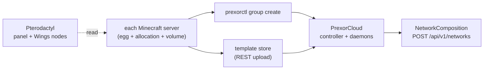

Pterodactyl and PrexorCloud are different categories of tool, so this is a
re-model, not a one-to-one port. Pterodactyl is a general game-server
hosting panel: Docker-isolated containers, eggs for many games, customer
accounts, per-server SFTP and backups. PrexorCloud is a Minecraft-network
orchestrator: process supervision (no Docker), groups that scale on player
count, a proxy fleet, and a Network composition that routes players. The
nouns line up far less cleanly than they do when migrating from CloudNet or
SimpleCloud — there is no importer, and some Pterodactyl features have no
PrexorCloud equivalent because PrexorCloud was never built to be a
multi-tenant panel.

This recipe maps the concepts, tells you plainly where they don't meet, and
gives the exact `prexorctl` commands and REST calls to rebuild a single
Minecraft network on PrexorCloud. For the "should I move at all?" question,
read [Is this the right move](#is-this-the-right-move) below before you start
typing.

## What you'll do



End state: each Pterodactyl Minecraft server becomes a PrexorCloud Group
(static for persistent worlds, dynamic for game-modes); each server's files
become a Template in PrexorCloud's content-addressed store; a proxy Group
plus a Network composition route players; Pterodactyl's Wings daemons are
shut down once the network is healthy.

## Is this the right move

Migrate if all of these hold:

- You run **one Minecraft network**, not multi-tenant hosting you sell to
  customers.
- You operate the cluster yourself — no customer self-service, no billing.
- You want **proxy-aware routing** and **player-count scaling** without
  hand-editing `velocity.toml`.
- You can accept **process-level, not container-level, isolation** between
  instances on a node (see [ADR 7 in Architecture](/concepts/architecture/)).
- You don't host non-Minecraft games (ARK, Rust, …) on the same hosts.

Stay on Pterodactyl if you sell hosting, need per-customer isolation and
quotas, or run multiple game titles. PrexorCloud has no billing, no tenant
model, and no per-server resource cgroups.

## Before you start

- A running PrexorCloud controller and at least one daemon node `READY` in
  `prexorctl node list`. If you don't have one, follow the
  [Quickstart](/getting-started/quickstart/).
- `prexorctl login` succeeds and `prexorctl status` shows the controller.
- A controller auth token in `$PREXOR_TOKEN` and the controller URL in
  `$CONTROLLER` for the REST steps (template and network creation have no
  CLI verb).
- Read access to your Pterodactyl panel and Wings hosts so you can copy
  server files and worlds off them.
- A maintenance window per game-mode of roughly 30 minutes; the only
  player-visible cutover is the proxy hand-off.

## 1. Map the concepts

Most Pterodactyl nouns have a PrexorCloud counterpart, but the fit is
looser than a cloud-to-cloud migration. Read this table with your panel
open.

| Pterodactyl | PrexorCloud | Notes |
|---|---|---|
| Panel | Controller + dashboard | PrexorCloud folds the API, scheduler, event stream, and web UI into the controller. The dashboard is admin-only — there is no customer-facing console. |
| Wings (node daemon) | Daemon | Both are per-host agents. PrexorCloud's daemon authenticates to the controller over mTLS and supervises bare JVM processes; Wings runs Docker containers. See [Concepts → Architecture](/concepts/architecture/). |
| Server | Instance *or* Group | A Pterodactyl "server" is a long-lived container you manage by hand. PrexorCloud splits this: an **Instance** is one running process; a **Group** is the spec that produces and scales instances. A persistent world maps to a `static` Group with one instance; an ephemeral game-mode maps to a `DYNAMIC` Group. |
| Egg | Platform + version + Template | An egg bundles software, startup command, and config variables. In PrexorCloud the software is `platform` + `platformVersion` resolved from the catalog, the config files live in a Template, and startup tuning is `jvmArgs` / `env`. There is no single "egg" object. |
| Egg / startup variables | Group `env` + `%VARIABLE%` + `configPatches` | Pterodactyl substitutes egg variables into the startup command and configs. PrexorCloud injects the group's `env` map into the process, substitutes `%PORT%`-style tokens in template files, and applies structured `configPatches`. See [Concepts → Groups, instances, templates](/concepts/groups-instances-templates/). |
| Allocation (IP:port) | Group port range | Pterodactyl assigns explicit IP:port allocations. A PrexorCloud Group declares `portRangeStart` / `portRangeEnd` and the scheduler allocates a port per instance from it. |
| Volume (`/home/container`) | Instance directory + `protectedPaths` | A persistent Pterodactyl volume maps to a `static` Group's preserved instance directory, with world paths listed in `protectedPaths` so a template re-apply never overwrites them. See [Recipes → Survival server](/recipes/survival-server/). |
| Backup (per-server button) | `backup-orchestrator` module + off-host copy | No per-server backup button. The `backup-orchestrator` module snapshots config on a schedule; world data is copied off-host yourself. See [Operations → Backups and DR](/operations/backups-and-dr/). |
| Per-server SFTP | Template files (REST) + `instance console` | No per-server SFTP. Manage files through the Template store and the dashboard editor; reach a live server with `prexorctl instance console <id>`. |
| Users / subusers / permissions | RBAC roles | PrexorCloud has 48 fine-grained permissions and named roles — but for **operators**, not customers. No tenant accounts, no billing. |
| Panel-managed MySQL databases | Not managed | PrexorCloud does not provision per-server databases. Point plugins at your own database. |

### What has no equivalent

Know these before you commit:

- **Container isolation.** The daemon supervises JVM processes directly —
  no Docker, no per-instance cgroup memory cap, no network namespace.
  Memory is bounded by the JVM heap (`memoryMb` → `-Xmx`), not by the
  kernel. [Architecture](/concepts/architecture/) states process isolation
  is not in v1 scope.
- **Multi-game support.** PrexorCloud runs Paper, Spigot, Purpur, Folia,
  Fabric, NeoForge, and the Velocity/BungeeCord/Waterfall proxies, plus
  Bedrock through Geyser. An ARK or Rust server stays on Pterodactyl.
- **Customer accounts and billing.** Operators are admins, not tenants.
- **One-click egg switching.** Changing software is a Group config change
  plus a redeploy, not a dropdown.

## 2. Inventory each Pterodactyl server

For every Minecraft server in the panel, record:

```text
- name, MC platform + version (from the egg)
- allocation port(s) and RAM limit
- the plugins/ or mods/ directory
- the world directory, and whether it must persist
- whether it sits behind a proxy you also run
- peak / off-peak player counts (this decides static vs dynamic)
```

Persistent single worlds (survival, creative, towny) become **static**
groups. Ephemeral game-modes (bedwars, skywars) become **dynamic** groups
with no world to copy.

## 3. Stand PrexorCloud up alongside

Install on separate hosts, or on the same hosts with a non-overlapping port
range so both stacks run during the cutover. The setup wizard installs one
component at a time:

```bash
# Controller (control-plane host) — non-interactive
sudo prexorctl setup --component controller --non-interactive
```

Add daemon nodes with a join token (see
[Getting started → Installation](/getting-started/installation/) and
[Guides → Multi-node setup](/guides/multi-node-setup/)). Confirm a node is
ready:

```bash
prexorctl node list
```

## 4. Recreate each server as a group

### Ephemeral game-modes → dynamic groups

A bedwars egg with a 2 GiB limit and player-driven demand becomes a
`DYNAMIC` group. The scheduler scales it between `--min` and `--max` on
player load:

```bash
prexorctl group create \
  --name bedwars \
  --platform paper \
  --platform-version 1.21.4 \
  --scaling-mode DYNAMIC \
  --min 1 --max 24 \
  --port-start 30200 --port-end 30299 \
  --memory 2048 \
  --template base-paper \
  --template bedwars
```

`scaleUpThreshold` (default `0.8`), `scaleDownAfterSeconds` (default `300`),
and `scaleCooldownSeconds` (default `60`) have no create flags. Set them on
`groups/bedwars.yml` on the controller or with a `PATCH`. This is the
behaviour Pterodactyl can't do natively — there, every instance is a
hand-created server. See
[Guides → Custom scaling rules](/guides/custom-scaling-rules/).

### Persistent worlds → static groups

A survival server whose world must never reset becomes a `STATIC` group with
exactly one instance and a preserved instance directory. Create the group:

```bash
prexorctl group create \
  --name survival \
  --platform paper \
  --platform-version 1.21.4 \
  --scaling-mode STATIC \
  --min 1 --max 1 \
  --port-start 30000 --port-end 30000 \
  --memory 4096 \
  --template survival
```

The controller stores each group as `groups/<name>.yml`. Open
`groups/survival.yml` and set the persistence fields the create flags don't
cover:

```yaml
# groups/survival.yml
name: survival
platform: PAPER
platformVersion: "1.21.4"
templates: [survival]
scalingMode: STATIC
minInstances: 1
maxInstances: 1
memoryMb: 4096
portRangeStart: 30000
portRangeEnd: 30000
jvmArgs:
  - "-XX:+UseG1GC"
  - "-XX:+ParallelRefProcEnabled"
static: true
staticInstanceNames: [survival-1]
protectedPaths:
  - world
  - world_nether
  - world_the_end
nodeAffinity: [node-survival]
```

- `static: true` preserves the instance directory across restarts and
  template re-applies (Pterodactyl's persistent volume).
- `staticInstanceNames` pins the instance identity (`survival-1`).
- `protectedPaths` lists paths the daemon never overwrites on re-apply —
  put your world directories here so a template change can't clobber them.
- `nodeAffinity` keeps the instance on the host that holds its preserved
  directory.

The full pattern, including scheduled snapshots, is in
[Recipes → Survival server](/recipes/survival-server/).

The PrexorCloud group YAML is **flat** — there is no nested `scaling:`,
`ports:`, `resources:`, or `volumes:` block, and there is no `exposeOnHost`
or `placement` field. The complete field list is in
[Concepts → Groups, instances, templates](/concepts/groups-instances-templates/).

Confirm every group landed:

```bash
prexorctl group list
```

## 5. Move server files into templates

Pterodactyl stores each server's files under its volume
(`/home/container`). PrexorCloud stores files in a content-addressed
template store on the controller, SHA-256-versioned. There is **no CLI
upload command** — `prexorctl template` only lists, shows version history,
and rolls back:

```bash
prexorctl template list                 # GET  /api/v1/templates
prexorctl template versions survival    # GET  /api/v1/templates/survival/versions
prexorctl template rollback survival    # POST /api/v1/templates/survival/rollback
```

Create templates and upload files through the dashboard's template editor or
the REST API. Create the template, then pack the server's config and
plugins and extract them server-side:

```bash
# Create the template metadata
curl -fsS -X POST "$CONTROLLER/api/v1/templates" \
  -H "Authorization: Bearer $PREXOR_TOKEN" \
  -H "Content-Type: application/json" \
  -d '{ "name": "survival", "platform": "PAPER" }'

# Pack the Pterodactyl server files — WITHOUT the world — and extract them
cd /var/lib/pterodactyl/volumes/<server-uuid>
tar czf /tmp/survival.tar.gz \
  --exclude=world --exclude=world_nether --exclude=world_the_end \
  plugins server.properties bukkit.yml spigot.yml
curl -fsS -X POST "$CONTROLLER/api/v1/templates/survival/files/extract" \
  -H "Authorization: Bearer $PREXOR_TOKEN" \
  -F "file=@/tmp/survival.tar.gz"
```

Three Pterodactyl conventions change here:

- **Keep the world out of the template.** Templates are re-applied on every
  start. The world lives in the `static` group's preserved instance
  directory (`protectedPaths`), not in the template — copy it directly to
  the daemon host (step 6), not into the store.
- **Egg variables become PrexorCloud variables.** Pterodactyl's startup
  variables map to two mechanisms: `%PORT%`, `%MAX_PLAYERS%`,
  `%INSTANCE_ID%`, `%GROUP%`, `%NODE_ID%`, and `%MEMORY%` are substituted
  into text files at instance prep, and anything else goes in the group's
  `env` map (injected as process environment, as `CLOUD_*` variables).
  Rewrite egg-variable tokens to the `%...%` form. See
  [Concepts → Groups, instances, templates](/concepts/groups-instances-templates/).
- **Shared files become a layer.** Don't duplicate a common plugin set into
  every template. Put it in one layer (`base-extras`) and list it in each
  group's `--template` chain. The chain composes
  `base → base-{platform} → {group} → {user templates}`, later layers
  overwriting earlier by path.

## 6. Copy persistent worlds to the daemon host

For each static group, copy the world off the Pterodactyl volume onto the
daemon node that pins the group, into the instance directory the daemon will
preserve:

```bash
# On node-survival
rsync -a \
  /var/lib/pterodactyl/volumes/<server-uuid>/world/ \
  /var/lib/prexorcloud/instances/survival-1/world/
```

For a crash-consistent copy, stop the Pterodactyl server first, or run
`save-off` / `save-all` in-game before the copy and `save-on` after.
Dynamic game-modes have no persistent world — skip this step for them.

## 7. Add the proxy and the network

Pterodactyl has no proxy fleet or routing layer — if you ran a proxy, it was
just another server with a hand-maintained `velocity.toml`. PrexorCloud
makes the proxy a Group and the routing a Network composition.

Create the proxy group:

```bash
prexorctl group create \
  --name proxy \
  --platform velocity \
  --platform-version 3.4.0 \
  --scaling-mode STATIC \
  --min 1 --max 1 \
  --port-start 25565 --port-end 25565 \
  --memory 512
```

The cloud plugin is already bundled into the proxy's `base-velocity` layer —
remove any hard-coded backend entries from your old `velocity.toml` before
reusing it as a template, since PrexorCloud writes the server list at
runtime.

Networks have **no `prexorctl` subcommand**. Create the composition over
REST at `/api/v1/networks` (or in the dashboard's network editor):

| Field | Meaning |
|---|---|
| `name` | Composition name (`[a-z0-9_][a-z0-9_-]*`). |
| `lobbyGroup` | Default join target and last-resort fallback. Must exist. |
| `fallbackGroups` | Ordered fallback chain tried after the lobby on a kick. |
| `memberGroups` | Backend groups in this network; empty means no restriction. |
| `proxyGroups` | Proxy groups this composition applies to; empty means all proxies. |
| `kickMessage` | Shown when every fallback is exhausted. Optional. |
| `bedrockLobbyGroup` | Join target for Bedrock players; blank means use `lobbyGroup`. |
| `bedrockFallbackGroups` | Bedrock-specific fallback chain; empty means use `fallbackGroups`. |

```bash
curl -fsS -X POST "$CONTROLLER/api/v1/networks" \
  -H "Authorization: Bearer $PREXOR_TOKEN" \
  -H "Content-Type: application/json" \
  -d '{
        "name": "main",
        "lobbyGroup": "lobby",
        "fallbackGroups": ["lobby"],
        "memberGroups": ["lobby", "survival", "bedwars"],
        "proxyGroups": ["proxy"],
        "kickMessage": "All lobbies are full — try again shortly."
      }'
```

The controller validates every referenced group, so create all groups before
the composition. On a join the proxy plugin connects to the first `RUNNING`
instance of `lobbyGroup ++ fallbackGroups`; on a kick it excludes the group
the player was kicked from. See
[Getting started → Your first network](/getting-started/your-first-network/).

The proxy is the only player-visible cutover. Once it's up and the
composition is applied, switch DNS to it.

## 8. Decommission Pterodactyl

When players are on the new proxy and every group is healthy, stop Wings on
each node and stop pointing DNS at it:

```bash
# On each Wings host
sudo systemctl stop wings
sudo systemctl disable wings
```

Keep the panel running for a couple of weeks for archive lookups; you don't
have to delete it.

## Verify it works

```bash
# Every server is now a group
prexorctl group list

# Every template you uploaded is present and hashed
prexorctl template list

# Each instance is running
prexorctl instance list
prexorctl instance info survival-1

# Crash history, if anything is flapping
prexorctl crash list
```

Read the network composition over REST:

```bash
curl -fsS "$CONTROLLER/api/v1/networks" \
  -H "Authorization: Bearer $PREXOR_TOKEN"
```

Then connect a Minecraft client to the new proxy. Check that:

- Persistent worlds (survival, creative) have their data intact.
- The first join lands on a lobby instance and `/server <name>` switches
  backends.
- Op and plugin permissions still apply.

## Common pitfalls

| Symptom | Likely cause and fix |
|---|---|
| World looks empty after migration | The world wasn't copied into the preserved instance directory, or `level-name` in `server.properties` points elsewhere. Copy it to `/var/lib/prexorcloud/instances/<name>/world/` (step 6). |
| World wiped after a template change | The world path isn't in `protectedPaths`, so the daemon overwrote it on re-apply. Add `world`, `world_nether`, `world_the_end`. |
| OOM during peak | Pterodactyl's container capped memory in a cgroup; PrexorCloud trusts the JVM heap. Right-size `--memory` and add `-XX:+ExitOnOutOfMemoryError` to `jvmArgs`. |
| Instance scheduled on the wrong node | A static group's preserved directory lives on one host. Pin it with `nodeAffinity`. |
| A config still contains an egg variable token | Pterodactyl variables aren't substituted. Set the value in the group's `env` map and reference `${VAR}`, or rewrite to a `%VARIABLE%` token, or bake it into the template. |
| `POST /api/v1/networks` returns a validation error | A referenced group (`lobbyGroup`, a `fallbackGroups`/`proxyGroups` entry) doesn't exist yet. Create all groups first. |
| Players hit "Connection lost" instead of fallback | No proxy group or no Network composition. Add the proxy group and the composition (step 7). |
| You miss the per-server SFTP UI | There isn't one. Use the template editor / REST upload for files and `prexorctl instance console <id>` for live access. |

## Where to go next

- [Concepts → Architecture](/concepts/architecture/) — read this before
  committing; it explains the no-Docker, process-supervision decision.
- [Getting started → Your first network](/getting-started/your-first-network/) —
  the proxy + lobby + game shape Pterodactyl can't build natively.
- [Recipes → Survival server](/recipes/survival-server/) — the closest
  one-to-one to "a Pterodactyl Minecraft server".
- [Recipes → BedWars network](/recipes/bedwars-network/) — the dynamic,
  player-count-scaled pattern.
- [Compare → CloudNet 4](/compare/cloudnet-4/) and
  [Compare → SimpleCloud V2](/compare/simplecloud-v2/) — if you're weighing
  PrexorCloud against a purpose-built MC orchestrator too.
