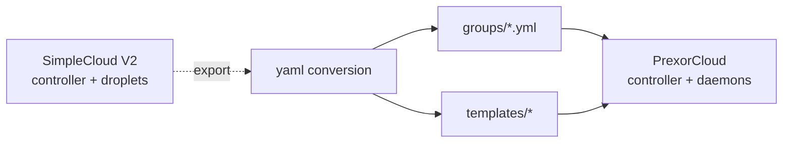

SimpleCloud V2 and PrexorCloud are close cousins: both are
controller-daemon shaped, both spawn JVM processes per server, both
ship a Velocity/Bungee plugin for routing. SimpleCloud's V2 rewrite
introduced an event bus, droplet abstraction, and gRPC controller
protocol — concepts that mirror PrexorCloud's directly. This recipe
walks through the migration.

## What you'll build



End state: every SimpleCloud group becomes a PrexorCloud group, every
template directory is pushed, the proxy is reconfigured, droplets stop
and the daemons take over.

## Prerequisites

- A working SimpleCloud V2 install (tested with v2.0.x).
- A working PrexorCloud v1.0+ controller and at least one daemon
  ([Quickstart](/getting-started/quickstart/)).
- A maintenance window of ~30 minutes per game-mode.

## 1. Concept mapping

| SimpleCloud V2 term | PrexorCloud term | Notes |
|---|---|---|
| **Controller** | **Controller** | Same role: REST + scheduler + state. PrexorCloud uses Mongo + Valkey, SimpleCloud uses Postgres + Redis. |
| **Droplet** | **Daemon node** | Per-host worker. SimpleCloud's `droplet.yml` ↔ PrexorCloud's `daemon.yml`. |
| **Group** | **Group** | Same concept: launch spec + scaling rules. SimpleCloud's `name`/`type`/`templates` map 1:1. |
| **Service** | **Instance** | A running JVM. Same FSM (`PREPARING → STARTING → ONLINE → STOPPING`). |
| **Template** | **Template (layered)** | SimpleCloud has flat templates with priority ordering; PrexorCloud composes a chain. |
| **Module (SimpleCloud)** | **Platform module** | Both are JVM jars loaded at controller runtime. SDKs are different. |
| **Player module** | **Player Journey Bus + cloud-plugin** | Player tracking is built-in; no module install. |
| **Sign module** | Out of v1 scope | SimpleCloud's signs are a separate plugin. PrexorCloud has SSE feeds; build the sign-plugin yourself or wait for a community module. |
| **NPC module** | Out of v1 scope | Same — community plugin space. |
| **Proxy plugin** | **Bundled cloud-plugin (proxy)** | PrexorCloud ships proxy plugins for Velocity and Bungee; routing comes from `NetworkComposition`. |
| **Webhook module** | **`webhook-alerts` module** | PrexorCloud ships the equivalent as a first-party module. See [Recipes → Discord Notifications](/recipes/discord-notifications/). |
| **Server software config** | **Catalog entry** | `prexorctl catalog list` enumerates platform/version pairs. Add custom entries via the controller config. |
| **Plugin templating** | **Env-injection + template chain** | SimpleCloud's `${TEMPLATE.field}` placeholders become PrexorCloud's `${PREXOR_*}` env vars. |
| **Database (Postgres)** | **MongoDB** | Both are durable state stores. PrexorCloud's `data-model.md` describes what lives where. |
| **Cache (Redis)** | **Valkey (or Redis)** | Same role: lease coordination, SSE replay, JWT revocation. |

What is **not** in the box and you'd have to write yourself:

- **Sign / NPC plugins** — see above. The cloud-plugin emits the
  events; the rendering plugin is yours.
- **Custom translations** — SimpleCloud's i18n module has no
  PrexorCloud equivalent. The dashboard is EN-only at v1.0.

## 2. Convert groups

SimpleCloud's `groups/<name>.yml` looks like:

```yaml
# SimpleCloud V2 — groups/lobby.yml
name: lobby
type: PROXY               # or SERVER, LOBBY
minOnlineServices: 2
maxOnlineServices: 4
maxPlayers: 100
serverSoftware:
  type: PAPER
  version: "1.21.4"
templates: [global, lobby]
startPort: 30000
maxMemory: 1024
permission: lobby.access
```

The PrexorCloud equivalent (`groups/lobby.yml`):

```yaml
name: lobby
platform: paper                 # SERVER → paper / spigot / folia; PROXY → velocity / bungee
version: "1.21.4"
scaling: { mode: STATIC, min: 2, max: 4 }
ports: { from: 30000, to: 30099 }
resources: { memoryMB: 1024 }
templates: [base-paper, lobby]
```

Notes:

- **`type` is implicit** in PrexorCloud — `platform: velocity/bungee`
  is a proxy; everything else is a server. There's no `LOBBY` type;
  you mark a group as the lobby through Network Composition.
- **`maxPlayers` lives on the Network Composition**, not the group.
- **`permission`** has no group-level equivalent. Player gating is a
  cloud-plugin concern — handle it via your permissions plugin.

If you used SimpleCloud's auto-scaling:

```yaml
# SimpleCloud
percentToStartNewService: 80
```

becomes:

```yaml
# PrexorCloud
scaling:
  mode: DYNAMIC
  metric: players
  target: 0.8
  min: 1
  max: 8
  scaleUpStep: 1
  scaleDownAt: 0.2
  cooldownSeconds: 60
```

Apply:

```bash
prexorctl group apply -f groups/
```

## 3. Push templates

SimpleCloud templates live at
`storage/templates/<name>/<environment>/`. PrexorCloud uses one
directory per template:

```bash
cp -r /opt/simplecloud/storage/templates/lobby templates/lobby
prexorctl template push templates/lobby/
```

A few SimpleCloud-specific things that need attention:

- **Per-environment subdirs.** SimpleCloud splits templates by
  `PRODUCTION`/`STAGING`. In PrexorCloud, environments are separate
  controllers (or separate group prefixes within one controller). Pick
  one directory per template and push.
- **Inclusions.** SimpleCloud's URL inclusions are pre-fetched at
  service-start time; the daemon does not. Bake the artefacts into
  the template directory and commit them.
- **Placeholder substitution.** SimpleCloud's `${TEMPLATE.name}`
  becomes `${PREXOR_TEMPLATE}`; `${SERVICE.name}` becomes
  `${PREXOR_INSTANCE_ID}`. The daemon injects them before spawn.

## 4. Reconfigure the proxy

In SimpleCloud, the Velocity proxy is a group running the SimpleCloud
proxy plugin. In PrexorCloud, the proxy plugin is bundled with the
runtime jar and the routing comes from `NetworkComposition`:

```yaml
# proxy.yml
name: proxy
platform: velocity
version: "3.4.0"
scaling: { mode: STATIC, min: 1, max: 1 }
ports: { from: 25565, to: 25565 }
exposeOnHost: true
```

```yaml
# network.yml
name: main
proxyGroup: proxy
lobbyGroup: lobby
fallbackGroups: [lobby]
gameGroups: [bedwars, skywars]
```

```bash
prexorctl group apply -f proxy.yml
prexorctl network apply -f network.yml
```

The proxy plugin caches the network from
`/api/proxy/networks` and resolves `/server <name>` and `/play
<group>` against the live composition. No proxy-side YAML.

## 5. Replace SimpleCloud modules

| SimpleCloud module | PrexorCloud equivalent |
|---|---|
| `webhook-module` | `webhook-alerts` (install per [Recipes → Discord Notifications](/recipes/discord-notifications/)). |
| `player-module` | Built-in (Player Journey Bus). |
| `notify-module` | `webhook-alerts` covers most cases; build a small platform module for in-game notifications. |
| `sign-module` | Community plugin space — port the sign-plugin against the cloud-plugin's SSE feed. |
| `npc-module` | Same — community plugin. |

For custom SimpleCloud modules you wrote yourself: rewrite against
`cloud-api`. The shape is similar (lifecycle hooks, EventBus, Mongo
storage) — see [Recipes → Custom Scaling Logic](/recipes/custom-scaling-logic/)
for a worked example.

## 6. Decommission SimpleCloud

```bash
# On every droplet
sudo systemctl stop simplecloud-droplet

# On the controller
sudo systemctl stop simplecloud-controller
```

Keep the install around for a couple of weeks as rollback insurance.

## How to verify it works

```bash
prexorctl group list                       # all your groups
prexorctl template list                    # all your templates
prexorctl network list                     # the composition
prexorctl status                           # cluster healthy
```

Connect a client through the new proxy. `/server` and `/play` should
behave as before. Check the audit log:

```bash
prexorctl audit query --since "1 hour ago"
```

## Common pitfalls

| Symptom | Likely cause |
|---|---|
| Templates fail to push: "no manifest" | PrexorCloud expects template directories, not zips. Unpack first. |
| Velocity proxy refuses to start | `velocity.toml` from SimpleCloud has hard-coded server entries. Remove them — PrexorCloud writes them dynamically. |
| Webhook module deactivates immediately | Mongo storage requested but controller in `development` profile. Switch to `production`. |
| Proxy `/server` lists all groups instead of just servers | The cloud-plugin's `/server` permission gates by Network Composition's `gameGroups + lobbyGroup`. Verify the network record. |
| Audit log misses pre-migration history | PrexorCloud's audit starts from cutover; SimpleCloud's audit lives in its own DB. Archive both. |

## Where to go next

- [Compare → SimpleCloud V2](/compare/simplecloud-v2/) — direct
  feature comparison.
- [Concepts → Architecture](/concepts/architecture/) — controller +
  daemon vs SimpleCloud's controller + droplet model.
- [Recipes → Custom Scaling Logic](/recipes/custom-scaling-logic/) —
  porting custom SimpleCloud modules to platform modules.
