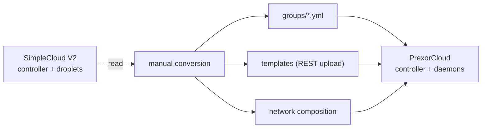

SimpleCloud V2 and PrexorCloud are close cousins. Both are
controller-plus-agent shaped, both spawn one JVM process per server,
both ship a Velocity/Bungee plugin for routing, and SimpleCloud's V2
rewrite introduced an event bus, a droplet abstraction, and a gRPC
controller protocol that line up with PrexorCloud's own design. This
recipe walks the migration end to end and gives you the exact config
fields and commands to type.

A note on accuracy: SimpleCloud's own field names evolve between
point releases. The SimpleCloud snippets below show the shape of a V2
config so you can recognize your own files; treat them as a guide, not
a schema. The PrexorCloud side is verified against the source — every
field, command, and endpoint here exists in this repository.

## What you'll build



End state: every SimpleCloud group is a PrexorCloud group, every
template is uploaded and versioned, the network routing is rebuilt as a
network composition, and the proxy runs the bundled cloud-plugin.
Droplets stop; daemons take over.

## Before you start

- A working SimpleCloud V2 install you can read configs from.
- A running PrexorCloud controller and at least one daemon
  ([Quickstart](/getting-started/quickstart/)).
- `prexorctl` authenticated against the controller (`prexorctl login`).
- A maintenance window of roughly 30 minutes per game mode.

## 1. Concept mapping

| SimpleCloud V2 | PrexorCloud | Notes |
|---|---|---|
| Controller | Controller | Same role: REST, scheduling, state. PrexorCloud stores durable state in MongoDB and uses Valkey/Redis for lease coordination, SSE replay, and JWT revocation. |
| Droplet | Daemon | Per-host worker that runs instances. |
| Group | Group | Launch spec plus scaling rules. Stored as `groups/<name>.yml` on the controller. |
| Service | Instance | One running JVM (server or proxy). |
| Template | Template | A versioned (SHA-256 hashed) file package. PrexorCloud composes templates as an ordered list per group. |
| SimpleCloud module | Platform module | Both are JVM jars the controller loads at runtime. The SDKs differ; see [§6](#6-replace-simplecloud-modules). |
| Proxy plugin | Bundled cloud-plugin (proxy) | PrexorCloud ships the proxy plugin for Velocity and Bungee. Routing comes from a network composition read over `GET /api/proxy/networks`. |
| Database (Postgres) | MongoDB | Durable state store. |
| Cache (Redis) | Valkey or Redis | Lease coordination, SSE replay, token revocation. |

What is not in the box, and you would write yourself:

- Sign and NPC plugins. The cloud-plugin emits the events; the
  rendering plugin is yours.
- An in-game notification UI. The `webhook-alerts` module covers
  outbound webhooks; in-game toasts are a plugin or a small module.

## 2. Convert groups

PrexorCloud stores each group as a flat YAML file at
`groups/<name>.yml` on the controller. This file is the single source
of truth — there is no database row behind it. The fields are flat
(no nested `scaling:` or `resources:` blocks).

A SimpleCloud V2 lobby group looks roughly like this:

```yaml
# SimpleCloud V2 (shape, not exact schema)
name: lobby
minOnlineCount: 2
maxOnlineCount: 4
maxPlayers: 100
startPort: 30000
maxMemory: 1024
template: lobby
```

The PrexorCloud equivalent, written to `groups/lobby.yml`:

```yaml
name: lobby
platform: PAPER
platformVersion: "1.21.4"
templates: [base-paper, lobby]
scalingMode: STATIC
minInstances: 2
maxInstances: 4
maxPlayers: 100
portRangeStart: 30000
portRangeEnd: 30099
memoryMb: 1024
```

Field-by-field mapping:

| SimpleCloud (V2 shape) | PrexorCloud field | Notes |
|---|---|---|
| `name` | `name` | Same; also the filename. |
| server software | `platform` + `platformVersion` | `platform` is uppercased by the controller. Proxy families are `VELOCITY`, `BUNGEECORD`, `WATERFALL`; everything else (`PAPER`, `SPIGOT`, `FOLIA`, …) is a server. |
| `template` / `templates` | `templates` | An ordered list. Later entries layer over earlier ones. |
| `minOnlineCount` | `minInstances` | — |
| `maxOnlineCount` | `maxInstances` | Defaults to `10` if unset. |
| `maxPlayers` | `maxPlayers` | Defaults to `100`. |
| `startPort` | `portRangeStart` | Defaults to `30000`. |
| (port ceiling) | `portRangeEnd` | Defaults to `30100`. Give each daemon enough room for `maxInstances` ports. |
| `maxMemory` | `memoryMb` | Defaults to `1024`. |
| static / persistent flag | `static: true` | Plus `staticInstanceNames` for fixed-name instances and `protectedPaths` for files that survive a redeploy. |

There is no group `type` field. A group is a proxy when its `platform`
is in the proxy family above; otherwise it is a server. There is no
`LOBBY` type either — you name the lobby in the network composition
([§4](#4-rebuild-the-network)), not on the group.

### Scaling mode

`scalingMode` accepts exactly three values: `STATIC`, `DYNAMIC`, or
`MANUAL`. Anything else is rejected with
`Unsupported scalingMode '<x>' (expected DYNAMIC, STATIC, or MANUAL)`.

If you used SimpleCloud's percentage-based auto-scaling, use
`DYNAMIC` and the dynamic fields:

```yaml
name: bedwars
platform: PAPER
platformVersion: "1.21.4"
templates: [base-paper, bedwars]
scalingMode: DYNAMIC
minInstances: 1
maxInstances: 8
maxPlayers: 16
scaleUpThreshold: 0.8        # fraction of capacity that triggers scale-up; default 0.8
scaleDownAfterSeconds: 300   # idle seconds before scaling down; default 300
scaleCooldownSeconds: 60     # min seconds between scaling actions; default 60
portRangeStart: 30200
portRangeEnd: 30299
memoryMb: 2048
```

### Creating the group

You can hand-write `groups/<name>.yml`, or create it through
`prexorctl`. The CLI maps flags onto the same fields:

```bash
prexorctl group create \
  --name lobby \
  --platform PAPER \
  --platform-version 1.21.4 \
  --template base-paper --template lobby \
  --scaling-mode STATIC \
  --min 2 --max 4 \
  --memory 1024 \
  --port-start 30000 --port-end 30099
```

`prexorctl group create` posts to `POST /api/v1/groups`. Verify and
adjust afterward:

```bash
prexorctl group list
prexorctl group info lobby
prexorctl group update lobby --max 6        # PATCH /api/v1/groups/lobby
```

There is no `prexorctl group apply -f <dir>`. To bulk-create, loop the
files yourself:

```bash
for f in groups/*.yml; do
  curl -fsS -X POST "$CONTROLLER/api/v1/groups" \
    -H "Authorization: Bearer $TOKEN" \
    -H "Content-Type: application/json" \
    --data-binary @<(yq -o=json "$f")
done
```

## 3. Move templates

PrexorCloud templates are file packages, not flat directories the
daemon reads in place. A template is created as metadata, then its
files are uploaded; the controller hashes the content (SHA-256) and
versions it. The daemon pulls the resolved template chain at instance
start.

There is no `prexorctl template push`. The CLI exposes only read and
version operations:

```bash
prexorctl template list                     # GET  /api/v1/templates
prexorctl template versions lobby           # GET  /api/v1/templates/lobby/versions
prexorctl template rollback lobby           # POST /api/v1/templates/lobby/rollback
```

Create and populate a template over REST. First create the metadata:

```bash
curl -fsS -X POST "$CONTROLLER/api/v1/templates" \
  -H "Authorization: Bearer $TOKEN" \
  -H "Content-Type: application/json" \
  -d '{"name":"lobby","description":"Lobby files","platform":"PAPER"}'
```

Then upload files. The file routes live under
`/api/v1/templates/{name}/files`:

- `POST /api/v1/templates/{name}/files/upload` — upload a file.
- `POST /api/v1/templates/{name}/files/extract` — upload an archive
  and extract it into the template tree.
- `POST /api/v1/templates/{name}/files/mkdir` — create a directory.

```bash
# Upload one file
curl -fsS -X POST "$CONTROLLER/api/v1/templates/lobby/files/upload" \
  -H "Authorization: Bearer $TOKEN" \
  -F "file=@server.properties"

# Or pack the SimpleCloud template directory and extract it server-side
tar czf lobby.tar.gz -C /opt/simplecloud/templates/lobby .
curl -fsS -X POST "$CONTROLLER/api/v1/templates/lobby/files/extract" \
  -H "Authorization: Bearer $TOKEN" \
  -F "file=@lobby.tar.gz"
```

Three SimpleCloud-specific things to handle while you move files:

- Per-environment subdirectories. If your SimpleCloud templates split
  by `PRODUCTION`/`STAGING`, flatten to the one directory you want and
  upload that. PrexorCloud has no per-template environment switch;
  separate environments are separate controllers or separate group
  names.
- URL inclusions. SimpleCloud can fetch artifacts at service start.
  The PrexorCloud daemon does not. Bake the jars and assets into the
  template before you upload it.
- Placeholders. SimpleCloud's templating tokens become PrexorCloud's
  variable substitution — see the next section.

### Template variables

When the daemon prepares an instance, it substitutes `%VARIABLE%`
tokens in text files (extensions `.properties`, `.yml`, `.yaml`,
`.toml`, `.json`, `.cfg`, `.conf`, `.txt`). The available variables
are:

| Token | Value |
|---|---|
| `%PORT%` | The instance's assigned port. |
| `%INSTANCE_ID%` | The instance id. |
| `%INSTANCE_NAME%` | Same as `%INSTANCE_ID%`. |
| `%GROUP%` | The group name. |
| `%NODE_ID%` | The daemon (node) id the instance runs on. |
| `%MEMORY%` | The group's `memoryMb`. |
| `%MAX_PLAYERS%` | The group's `maxPlayers` (falls back to `100`). |

So a `server.properties` line becomes:

```properties
server-port=%PORT%
max-players=%MAX_PLAYERS%
```

Rewrite any SimpleCloud `{{...}}` or `${...}` template tokens to the
`%...%` form above before you upload. Tokens with no matching variable
are left untouched.

### Instance environment variables

Separately, the daemon injects these environment variables into every
instance process — useful from plugins and start scripts, but not
substituted into template files:

`CLOUD_INSTANCE_ID`, `CLOUD_GROUP`, `CLOUD_PORT`, `CLOUD_NODE_ID`,
`CLOUD_CONTROLLER_URL`, `CLOUD_PLUGIN_TOKEN`, `CLOUD_CPU_RESERVATION`,
`CLOUD_DISK_RESERVATION_MB`.

## 4. Rebuild the network

In SimpleCloud, proxy routing lives in the proxy plugin's config. In
PrexorCloud, it is a named network composition stored on the
controller and read by every proxy over `GET /api/proxy/networks`. The
proxy plugin is bundled with the runtime — there is no proxy-side YAML
to edit.

First define the proxy group like any other group, on a proxy
platform:

```yaml
# groups/proxy.yml
name: proxy
platform: VELOCITY
platformVersion: "3.4.0"
templates: [base-velocity]
scalingMode: STATIC
minInstances: 1
maxInstances: 1
portRangeStart: 25565
portRangeEnd: 25565
memoryMb: 512
```

Then create the network composition. There is no `prexorctl network`
command; networks are managed over REST at `/api/v1/networks`. The
body fields come straight from the `NetworkComposition` record:

| Field | Meaning |
|---|---|
| `name` | Unique id, matches `[a-z0-9_][a-z0-9_-]*`. |
| `description` | Optional human-readable text. |
| `lobbyGroup` | Default join target and last-resort fallback. Required. |
| `fallbackGroups` | Ordered fallback chain tried when a backend instance fails. |
| `memberGroups` | Backend groups in this network; empty means no restriction. |
| `proxyGroups` | Proxy groups this composition applies to; empty means all proxies. Entries must reference proxy-platform groups. |
| `kickMessage` | Shown when all fallbacks are exhausted. |
| `bedrockLobbyGroup` | Optional Bedrock join target; blank means use `lobbyGroup`. |
| `bedrockFallbackGroups` | Optional Bedrock fallback chain; empty means use `fallbackGroups`. |

```bash
curl -fsS -X POST "$CONTROLLER/api/v1/networks" \
  -H "Authorization: Bearer $TOKEN" \
  -H "Content-Type: application/json" \
  -d '{
        "name": "main",
        "description": "Primary network",
        "lobbyGroup": "lobby",
        "fallbackGroups": ["lobby"],
        "memberGroups": ["lobby", "bedwars", "skywars"],
        "proxyGroups": ["proxy"],
        "kickMessage": "All lobbies are full, try again shortly."
      }'
```

All referenced groups (`lobbyGroup`, `fallbackGroups`, `memberGroups`,
`proxyGroups`) must already exist, and `proxyGroups` entries must be
proxy-platform groups, or the create returns `400`. A duplicate name
returns `409`.

There is no `gameGroups` field. A backend is reachable through the
proxy when it is in `memberGroups` (or when `memberGroups` is empty);
the lobby is `lobbyGroup`; the rest is fallback ordering.

## 5. Cut over the proxy

With the proxy group and network composition in place, the bundled
cloud-plugin resolves joins and fallbacks against the live
composition. Remove any hard-coded backend entries from your old
`velocity.toml` / Bungee `config.yml` before you reuse those files as
a template — PrexorCloud manages the server list at runtime, and stale
static entries cause the proxy to refuse to start.

Bring the proxy group up and connect a client. Joins should land on
`lobbyGroup`; backend failures should walk `fallbackGroups`.

## 6. Replace SimpleCloud modules

PrexorCloud ships several first-party modules under
`java/cloud-modules/`. The relevant ones for a migration:

| SimpleCloud module | PrexorCloud equivalent |
|---|---|
| Webhook / notify | `webhook-alerts`. See [Recipes → Discord Notifications](/recipes/discord-notifications/). |
| Discord bridge | `discord-bridge`. |
| Player tracking | `player-journey`. |
| Tab list | `tablist`. |
| Stats | `stats-aggregator`. |
| Backups | `backup-orchestrator`. |
| Sign / NPC | No first-party module. Build a plugin against the cloud-plugin's event feed. |

Install a module through the CLI. `prexorctl module install` accepts a
jar, a signed bundle, or a registry id:

```bash
prexorctl module install <jar | bundle.tar | id[@version]>
prexorctl module list
```

For custom SimpleCloud modules you wrote yourself, rewrite against
`cloud-api`. A platform module implements `PlatformModule` with
lifecycle hooks (`onLoad`, `onStart`, `onStop`, `onUnload`,
`onUpgrade`, `onReload`) and a `ModuleContext` that exposes the
module's manifest, capabilities, persistent storage, event bus,
logger, scheduler, HTTP, and JSON. A module can mount its own REST
routes by overriding `onRegisterRoutes`; they are served under
`/api/v1/modules/{moduleId}/` behind the controller's auth and
rate-limit middleware. See
[Recipes → Custom Scaling Logic](/recipes/custom-scaling-logic/) for a
worked port.

## 7. Decommission SimpleCloud

```bash
# On every droplet host
sudo systemctl stop simplecloud-droplet

# On the SimpleCloud controller host
sudo systemctl stop simplecloud-controller
```

Keep the old install around for a couple of weeks as rollback
insurance.

## Verify the cutover

```bash
prexorctl group list             # every migrated group present
prexorctl template list          # every template uploaded and hashed
prexorctl status                 # controller + daemons healthy
```

```bash
# Networks have no CLI verb — read them over REST
curl -fsS "$CONTROLLER/api/v1/networks" \
  -H "Authorization: Bearer $TOKEN"
```

Connect a client through the new proxy and confirm joins land on the
lobby group and fallbacks work. Drive a group through the interactive
view if you want a live instance list:

```bash
prexorctl group info lobby
```

## Common pitfalls

| Symptom | Likely cause |
|---|---|
| `group create` rejected with an `Unsupported scalingMode` error | `scalingMode` must be exactly `STATIC`, `DYNAMIC`, or `MANUAL`. |
| Template substitution does nothing | The token form is `%PORT%`, not `${PORT}` or `{{port}}`, and only text extensions (`.properties`, `.yml`, `.toml`, …) are processed. |
| Network create returns `400` | A referenced group does not exist yet, or a `proxyGroups` entry is not a proxy-platform group. Create the groups first. |
| Network create returns `409` | A network with that name already exists. Use `PUT /api/v1/networks/{name}` to update. |
| Proxy refuses to start | Old `velocity.toml` / Bungee config carried hard-coded backend entries. Remove them; PrexorCloud writes the server list at runtime. |
| A group runs out of ports | `portRangeEnd - portRangeStart` is smaller than `maxInstances` on a single daemon. Widen the range. |
| Instances land on the wrong platform family | `platform` decides server vs proxy. Only `VELOCITY`, `BUNGEECORD`, `WATERFALL` are proxies; everything else is a server. |

## Where to go next

- [Concepts → Architecture](/concepts/architecture/) — controller +
  daemon versus SimpleCloud's controller + droplet model.
- [Recipes → Discord Notifications](/recipes/discord-notifications/) —
  installing the `webhook-alerts` module.
- [Recipes → Custom Scaling Logic](/recipes/custom-scaling-logic/) —
  porting a custom SimpleCloud module to a platform module.
