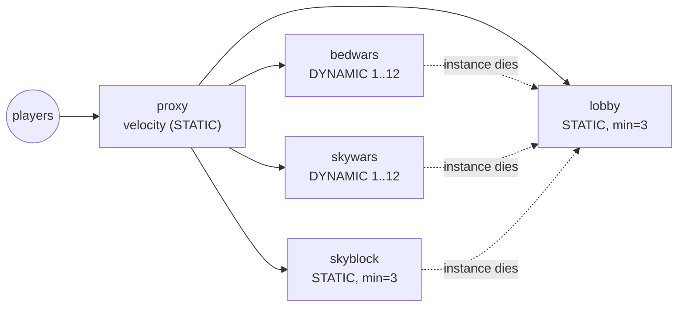

A multi-game network on PrexorCloud: one Velocity proxy on the public
edge, a lobby group, and three game-mode groups (BedWars, SkyWars,
SkyBlock). A single Network Composition tells the proxy where to spawn
joining players and where to send them when a backend instance dies.
Node labels plus a per-group spread constraint keep instances of the
same group off the same failure domain.

This recipe uses `prexorctl` and the controller REST API directly. The
CLI manages groups through flags and the REST API; networks are created
by `POST /api/v1/networks`. There is no YAML "apply" verb — every config
is a flag set or a JSON body, shown below in full.

## What you'll build



End state: five groups, one Network Composition named `main`, the
`lobby` group set as both join target and last-resort fallback, and the
two queue-shaped game modes scaling on player ratio.

## How routing actually works

Two pieces decide where players go, and it helps to keep them straight:

- The **Network Composition** (`NetworkComposition`) is a control-plane
  record: `name`, `lobbyGroup`, `fallbackGroups`, `memberGroups`,
  `proxyGroups`, `kickMessage`, plus optional Bedrock overrides. The
  proxy plugin reads it from `GET /api/proxy/networks`.
- The **proxy plugin** resolves routing through `NetworkRouter`. On
  first join it sends the player to `lobbyGroup`. On a kick or backend
  failure it walks `[lobbyGroup] ++ fallbackGroups`, skipping the group
  the player was kicked from, and connects to the first reachable
  instance. When every entry is exhausted it disconnects the player
  with `kickMessage`.

A network is matched to a proxy by its `proxyGroups` list: an entry that
names your proxy group applies to it, and a network with an empty
`proxyGroups` applies to every proxy. The game-mode groups themselves
are reachable as proxy servers because the plugin registers each running
backend instance with the proxy under its group; players move between
them with your own server-selector menu, a navigator plugin, or
`/server <group>` from a backend plugin — PrexorCloud does not ship a
`/play` command of its own.

## Prerequisites

- A PrexorCloud v1.0+ controller and at least three daemon nodes. Set up
  per [Getting started](/getting-started/quickstart/) and the multi-node guide.
- Each daemon labelled with a `region` (or `zone`) key in its config, so
  the spread constraint has something to bucket on. See step 1.
- A working `prexorctl login` against the controller, with a token that
  carries the `groups:create` and `networks:create` permissions.

## 1. Label the nodes

Spread is a soft scheduling weight: when the scheduler places a new
instance, instances of the same group are pushed toward nodes whose
spread-label value is least represented. The label comes from each
daemon's config file, under the top-level `labels` map:

```json
{
  "nodeId": "node-1",
  "advertiseAddress": "10.0.1.11",
  "controller": { "address": "controller.internal:8081" },
  "labels": { "region": "eu-west-1a" }
}
```

Give `node-2` and `node-3` `region: eu-west-1b` and `region: eu-west-1c`
respectively, then restart each daemon so it re-registers with the new
labels. Confirm the nodes are online:

```bash
prexorctl node list
# ID       STATUS   CPU   MEMORY            INSTANCES   CONNECTED SINCE
# node-1   ONLINE   3%    1024/32768 MB     0           just now
# node-2   ONLINE   2%    1024/32768 MB     0           just now
# node-3   ONLINE   4%    1024/32768 MB     0           just now
```

`node list` does not print labels; the controller uses them internally
for the `spreadConstraint` weighting and for `nodeAffinity` /
`nodeAntiAffinity` matching.

## 2. Create the five groups

`prexorctl group create` takes flags for the common fields and posts the
rest as defaults. The flags it accepts are `--name`, `--platform`,
`--platform-version`, `--template` (repeatable), `--scaling-mode`,
`--min`, `--max`, `--memory`, `--routing`, `--port-start`, `--port-end`.

`--scaling-mode` is one of `STATIC`, `DYNAMIC`, `MANUAL`. The proxy and
the persistent worlds are `STATIC`; the queue-shaped modes are
`DYNAMIC`.

```bash
# Proxy on the public edge
prexorctl group create \
  --name proxy \
  --platform velocity \
  --platform-version 3.4.0 \
  --template base-velocity --template proxy \
  --scaling-mode STATIC \
  --min 1 --max 1 \
  --memory 768 \
  --port-start 25565 --port-end 25565

# Lobby: three replicas, spread across regions
prexorctl group create \
  --name lobby \
  --platform paper \
  --platform-version 1.21.4 \
  --template base-paper --template lobby \
  --scaling-mode STATIC \
  --min 3 --max 3 \
  --memory 1024 \
  --port-start 25600 --port-end 25699

# BedWars: scale up when instances fill
prexorctl group create \
  --name bedwars \
  --platform paper \
  --platform-version 1.21.4 \
  --template base-paper --template bedwars \
  --scaling-mode DYNAMIC \
  --min 1 --max 12 \
  --memory 2048 \
  --port-start 25700 --port-end 25799

# SkyWars: same shape as BedWars
prexorctl group create \
  --name skywars \
  --platform paper \
  --platform-version 1.21.4 \
  --template base-paper --template skywars \
  --scaling-mode DYNAMIC \
  --min 1 --max 12 \
  --memory 2048 \
  --port-start 25800 --port-end 25899

# SkyBlock: persistent worlds, fixed count
prexorctl group create \
  --name skyblock \
  --platform paper \
  --platform-version 1.21.4 \
  --template base-paper --template skyblock \
  --scaling-mode STATIC \
  --min 3 --max 3 \
  --memory 3072 \
  --port-start 25900 --port-end 25999
```

`group create` covers the fields a flag exists for. The placement
fields (`spreadConstraint`, `nodeAffinity`, `nodeAntiAffinity`),
`maxPlayers`, the scaling thresholds, and `dependsOn` are part of the
group config but have no `create` flag — set them with a `PATCH` against
`/api/v1/groups/<name>`. For example, give the backend groups a region
spread and a player capacity that the autoscaler can measure against:

```bash
# spreadConstraint is a node-label KEY (or "key=value"); only the key is
# used for bucketing. maxPlayers is the per-instance capacity the
# autoscaler compares against scaleUpThreshold.
for g in lobby bedwars skywars skyblock; do
  curl -fsS -X PATCH "$CONTROLLER/api/v1/groups/$g" \
    -H "Authorization: Bearer $TOKEN" \
    -H 'Content-Type: application/json' \
    -d '{"spreadConstraint":"region","maxPlayers":100}'
done
```

How DYNAMIC scaling reads those numbers: each evaluation tick, the
scheduler scales a group up by one instance when **every** running
instance is at or above `scaleUpThreshold` of `maxPlayers`
(`playerCount / maxPlayers >= scaleUpThreshold`), bounded by
`maxInstances` and a per-group `scaleCooldownSeconds`. It scales down
toward `minInstances` once a group falls back under capacity, never
below `minInstances`, and never for `STATIC` or `MANUAL` groups.
`scaleUpThreshold` must be in `(0, 1]`; the default is `0.8`. To make
BedWars scale at 70% full:

```bash
curl -fsS -X PATCH "$CONTROLLER/api/v1/groups/bedwars" \
  -H "Authorization: Bearer $TOKEN" \
  -H 'Content-Type: application/json' \
  -d '{"scaleUpThreshold":0.7,"scaleCooldownSeconds":60}'
```

Check the result:

```bash
prexorctl group list
# GROUP     TYPE     STATUS   INSTANCES   PLAYERS   VERSION          UPDATED
# bedwars   GAME     UP       1/12        0         paper-1.21.4     just now
# lobby     STATIC   UP       3/3         0         paper-1.21.4     just now
# proxy     STATIC   UP       1/1         0         velocity-3.4.0   just now
# skyblock  STATIC   UP       3/3         0         paper-1.21.4     just now
# skywars   GAME     UP       1/12        0         paper-1.21.4     just now
```

The `TYPE` column shows `STATIC` for static groups and `GAME` otherwise;
`INSTANCES` is `running/max`.

## 3. Create the Network Composition

The network is a JSON body posted to `/api/v1/networks`. Its fields are
exactly those of `NetworkComposition`:

- `name` — must match `[a-z0-9_][a-z0-9_-]*`.
- `lobbyGroup` — required; the join target and the last-resort fallback.
- `fallbackGroups` — ordered chain tried after the lobby on a kick.
- `memberGroups` — backend groups in this network; empty means no
  restriction.
- `proxyGroups` — proxy groups this network applies to; empty means all
  proxies. Entries must name proxy-platform groups.
- `kickMessage` — shown when every fallback is exhausted.
- `bedrockLobbyGroup` / `bedrockFallbackGroups` — optional Bedrock-only
  overrides; blank/empty means Bedrock players follow the Java route.

All referenced groups must already exist, so create them (step 2) first.

```bash
curl -fsS -X POST "$CONTROLLER/api/v1/networks" \
  -H "Authorization: Bearer $TOKEN" \
  -H 'Content-Type: application/json' \
  -d '{
    "name": "main",
    "description": "Lobby plus three game modes",
    "lobbyGroup": "lobby",
    "fallbackGroups": ["lobby"],
    "memberGroups": ["lobby", "bedwars", "skywars", "skyblock"],
    "proxyGroups": ["proxy"],
    "kickMessage": "All servers are full or restarting. Try again shortly."
  }'
# 201 Created, echoes the stored composition
```

The proxy plugin polls `GET /api/proxy/networks`, matches this network to
the `proxy` group through `proxyGroups`, and from then on spawns joining
players into `lobby` and falls them back to `lobby` on any kick.

List and inspect what's stored:

```bash
curl -fsS "$CONTROLLER/api/v1/networks"      -H "Authorization: Bearer $TOKEN"
curl -fsS "$CONTROLLER/api/v1/networks/main" -H "Authorization: Bearer $TOKEN"
```

To change routing later, `PUT` the full composition back to
`/api/v1/networks/main` (the body `name` must match the path), or
`DELETE` it.

## 4. Roll a template change to the lobby

When you update the lobby's plugin config — a server-selector GUI, a
navigator, region MOTDs — roll the group so each instance picks it up
without a full outage. `prexorctl deploy` drives the rollout:

```bash
prexorctl deploy lobby --strategy rolling --batch-size 1 --health-gate
```

`deploy` flags are `--strategy`, `--batch-size`, `--canary-instances`,
`--canary-percent`, `--health-gate`, `--auto-rollback`,
`--promotion-timeout`, `--min-healthy`, and `-y/--yes` to skip the
confirmation prompt. With `--batch-size 1` the lobby's three replicas
roll one at a time; `--health-gate` holds promotion until the new
instances report healthy.

## How to verify it works

Connect a Java client to the proxy's public address. You should land in
the lobby. Then exercise the routing.

Confirm instances are spread across regions. With `spreadConstraint:
region` and three `lobby` replicas across three region values, the
scheduler places one per region:

```bash
prexorctl instance list --group lobby
# ID         GROUP   NODE     STATE     PORT    PLAYERS   UPTIME
# lobby-...   lobby   node-1   RUNNING   25600   0         ...
# lobby-...   lobby   node-2   RUNNING   25600   0         ...
# lobby-...   lobby   node-3   RUNNING   25600   0         ...
```

`instance list` accepts `--group`, `--node`, and `--state` filters.

Confirm fallback. Force-stop a BedWars instance a player is on and watch
the proxy redirect them to the lobby:

```bash
prexorctl instance stop bedwars-1 --force
# Instance bedwars-1 force-stopped
```

On Velocity this fires `KickedFromServerEvent`; `NetworkRouter` returns
`[lobby]` (the kicked group `bedwars` is excluded from the chain) and the
plugin issues `RedirectPlayer` to a live `lobby` instance. The player
stays connected to the proxy and reappears in the lobby.

Confirm the autoscaler. Drive a BedWars instance to 70% of its
`maxPlayers` and watch a second instance schedule once all running
instances clear the threshold:

```bash
prexorctl group list --filter bedwars --watch
# bedwars  GAME  UP  1/12  ...
# bedwars  GAME  UP  2/12  ...   ← scaled up after the cooldown
```

Confirm a node drain reschedules the spread. Drain a node and watch the
group recover; the rescheduled instance prefers the regions now
under-represented:

```bash
prexorctl node drain node-1
# Node node-1 set to DRAINING
prexorctl instance list --group lobby
prexorctl node undrain node-1
# Node node-1 set to ONLINE
```

## Notes and gotchas

- **Spread is soft, not a hard cap.** The scheduler weights placement
  toward under-represented spread buckets (about 15% of the node score);
  it does not refuse to place an instance when a region is full. During a
  region outage you can end up with two replicas in one region — that is
  by design, so placement never blocks on the constraint.
- **`maxPlayers` is the autoscaler's denominator.** If you leave it at
  the default (100) but cap a mode at fewer real slots in-game, the
  scale-up threshold won't line up with how full the server feels. Set
  `maxPlayers` per group to the real capacity.
- **`routing` is not part of the group's public config.** The CLI
  accepts a `--routing` flag, but the controller does not expose or
  persist a `routing` field on the group; per-edition lobby/fallback
  selection lives on the Network Composition, not the group.
- **Bedrock.** If only some backends run Geyser, set
  `bedrockLobbyGroup` / `bedrockFallbackGroups` on the network so Bedrock
  players route only to Geyser-capable groups. Leaving them blank routes
  Bedrock players through the same Java `lobbyGroup` / `fallbackGroups`.

## Where to go next

- [Concepts → Scheduling](/concepts/scheduling-and-scaling/) — how the weighted node selector
  scores placement, including the spread term.
- [Reference → REST API](/reference/rest-api/) — the full `NetworkComposition` and
  group schemas and every `/api/v1/networks` and `/api/v1/groups` route.
- [Guides → Custom scaling rules](/guides/custom-scaling-rules/) — tuning
  `scaleUpThreshold`, `scaleCooldownSeconds`, and `maxPlayers` per group.
