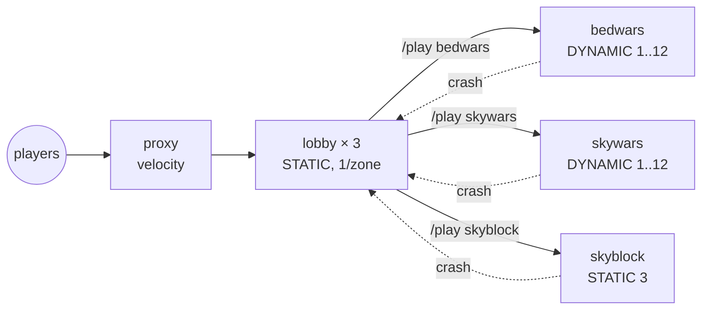

A production-shaped multi-game network. Three nodes across distinct
availability zones, one Velocity proxy on the public edge, a lobby
group, and three independent game-mode groups (BedWars, SkyWars,
SkyBlock). Anti-affinity keeps replicas off the same node; region
labels keep replicas off the same AZ; one Network Composition wires
the whole thing together.

## What you'll build



End state: five groups, one Network Composition, anti-affinity across
three AZs, dynamic scaling on two of three game-modes, fallback to the
lobby on every kick.

## Prerequisites

- PrexorCloud v1.0+ controller and three daemon nodes labelled with
  distinct `region` values. Set up via [Guides → Multi-Node Setup](/guides/multi-node-setup/).
- About 70 GiB total RAM headroom across the three nodes for the peak
  case.
- A working `prexorctl login`.

## 1. Confirm node labels

```bash
prexorctl node list
# NODE     LABELS                          RUNNING
# node-1   region=eu-west-1a,zone=a        0
# node-2   region=eu-west-1b,zone=b        0
# node-3   region=eu-west-1c,zone=c        0
```

If yours doesn't show `region=…`, label the daemons first per
[Guides → Multi-Node Setup](/guides/multi-node-setup/) §3.

## 2. Define the five groups

Save these as `proxy.yml`, `lobby.yml`, and one file per game-mode.
Common pattern: STATIC + AZ-spread for the proxy and lobby, DYNAMIC
for queue-shaped games, STATIC for SkyBlock (one persistent world per
instance, doesn't auto-scale).

```yaml
# proxy.yml
name: proxy
platform: velocity
version: "3.4.0"
scaling: { mode: STATIC, min: 1, max: 1 }
ports: { from: 25565, to: 25565 }
exposeOnHost: true
resources: { memoryMB: 768 }
templates: [base-velocity, proxy]
```

```yaml
# lobby.yml
name: lobby
platform: paper
version: "1.21.4"
scaling: { mode: STATIC, min: 3, max: 3 }
ports: { from: 25600, to: 25699 }
resources: { memoryMB: 1024 }
templates: [base-paper, lobby]
placement:
  spreadConstraint: { topologyKey: region, maxSkew: 1 }
```

```yaml
# bedwars.yml
name: bedwars
platform: paper
version: "1.21.4"
scaling:
  mode: DYNAMIC
  metric: players
  target: 0.7
  min: 1
  max: 12
  scaleUpStep: 2
  scaleDownStep: 1
  cooldownSeconds: 60
ports: { from: 25700, to: 25799 }
resources: { memoryMB: 2048 }
templates: [base-paper, bedwars]
dependsOn: [lobby]
placement:
  spreadConstraint: { topologyKey: region, maxSkew: 2 }
```

```yaml
# skywars.yml
name: skywars
platform: paper
version: "1.21.4"
scaling:
  mode: DYNAMIC
  metric: players
  target: 0.7
  min: 1
  max: 12
  scaleUpStep: 2
  cooldownSeconds: 60
ports: { from: 25800, to: 25899 }
resources: { memoryMB: 2048 }
templates: [base-paper, skywars]
dependsOn: [lobby]
placement:
  spreadConstraint: { topologyKey: region, maxSkew: 2 }
```

```yaml
# skyblock.yml
name: skyblock
platform: paper
version: "1.21.4"
scaling: { mode: STATIC, min: 3, max: 3 }
ports: { from: 25900, to: 25999 }
resources: { memoryMB: 3072 }
templates: [base-paper, skyblock]
volumes:
  - hostPath: /var/lib/prexorcloud/worlds/skyblock-{{.InstanceId}}
    mountPath: ./world
dependsOn: [lobby]
placement:
  spreadConstraint: { topologyKey: region, maxSkew: 1 }
```

`{{.InstanceId}}` in `hostPath` is templated by the daemon at
materialise time so each SkyBlock instance gets its own world
directory.

Apply all five:

```bash
prexorctl group apply -f proxy.yml -f lobby.yml -f bedwars.yml -f skywars.yml -f skyblock.yml
prexorctl group list
# proxy     1/1   RUNNING
# lobby     3/3   RUNNING
# bedwars   1/12  RUNNING
# skywars   1/12  RUNNING
# skyblock  3/3   RUNNING
```

## 3. Apply the Network Composition

```yaml
# network.yml
name: main
proxyGroup: proxy
lobbyGroup: lobby
fallbackGroups: [lobby]
gameGroups: [bedwars, skywars, skyblock]
motd: "<gold>Multi-Game Network</gold>"
maxPlayers: 1000
```

```bash
prexorctl network apply -f network.yml
```

The proxy plugin caches this and resolves `/play <group>` from the
lobby's cloud-plugin against `gameGroups`. On any kick, it walks
`fallbackGroups` and lands the player back in the lobby.

## 4. Enable `/play` and `/server` in the lobby template

```yaml
# templates/lobby/plugins/cloud-plugin/config.yml
commands:
  play:
    enabled: true
    permission: minecraft.command.play
  server:
    enabled: true
    permission: minecraft.command.server
```

Push and roll:

```bash
prexorctl template push templates/lobby/
prexorctl deploy lobby --strategy rolling --batch-size 1 --health-gate
```

## How to verify it works

Connect to the proxy's public IP. From the lobby, `/play bedwars`,
`/play skywars`, `/play skyblock` should each land you on a free
instance of the named group.

```bash
# Confirm AZ-spread
prexorctl instance list --group lobby
# lobby-1  node-1  region=eu-west-1a
# lobby-2  node-2  region=eu-west-1b
# lobby-3  node-3  region=eu-west-1c

# Confirm fallback
prexorctl instance stop bedwars-1 --force --no-graceful
prexorctl player journey <your-uuid> --limit 5
# INSTANCE_CRASHED  bedwars-1
# PLAYER_TRANSFER   bedwars-1 -> lobby-2
```

Force a zone outage by draining a node:

```bash
prexorctl node drain node-1 --shutdown=false --timeout 5m
prexorctl instance list --group lobby
# lobby-2  node-2  RUNNING
# lobby-3  node-3  RUNNING
# lobby-4  node-2  RUNNING        ← rescheduled, but spread skews 2/0/1
```

Note that `maxSkew: 1` lets the scaler tolerate one extra replica on a
single zone during outages — the constraint is "soft" enough not to
block placement.

## Where to go next

- [Recipes → BedWars Network](/recipes/bedwars-network/) — single-game
  with the same pattern, more depth on game-side config.
- [Recipes → Reverse Proxy](/recipes/reverse-proxy/) — front Velocity
  with nginx + Cloudflare; real-IP forwarding through the proxy plugin.
- [Recipes → Discord Notifications](/recipes/discord-notifications/) —
  alert on crashes and deployments across all five groups.
- [Guides → Custom Scaling Rules](/guides/custom-scaling-rules/) —
  per-group target tuning and Friday-evening overlays.
