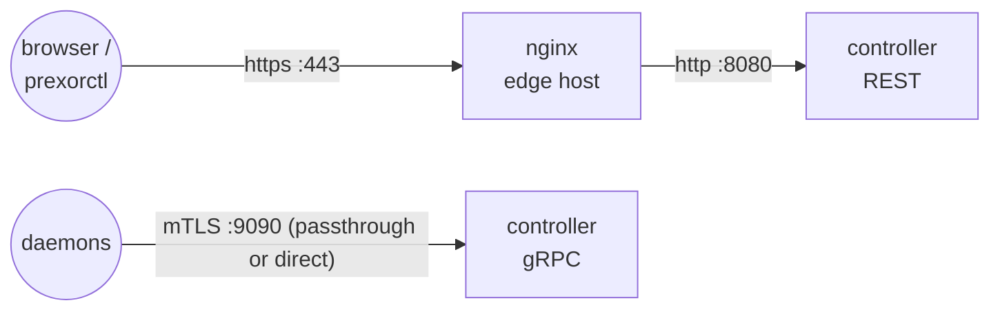

The controller exposes two listeners: a plain-HTTP REST API (Javalin/Jetty,
default `:8080`) that the dashboard and `prexorctl` talk to, and a gRPC server
(default `:9090`) that daemons connect to. Neither speaks TLS on the REST side
out of the box, and the gRPC side enforces mutual TLS with certificates the
controller's own CA mints. That split decides what a reverse proxy can and
can't do here:

- **REST** — terminate TLS at nginx and forward plain HTTP to the controller.
  This is the supported, common setup.
- **gRPC** — pass it through at the TCP layer (nginx `stream`) or don't proxy
  it at all. Terminating TLS in front of gRPC strips the daemon's client
  certificate and the controller rejects the connection.

This recipe covers both, plus the two configuration details that bite people:
CORS for the dashboard origin, and the fact that the controller reads the
peer's TCP address (`ctx.ip()`), not `X-Forwarded-For`.

## What you'll build



End state: operators and the dashboard reach the REST API over HTTPS through
nginx; CORS lets the dashboard's HTTPS origin call the API; daemons keep their
end-to-end mTLS to the gRPC port.

## Before you start

- A running controller from
  [Getting started](/getting-started/quickstart/) — you know its REST port
  (`http.port`, default `8080`) and gRPC port (`grpc.port`, default `9090`)
  from `controller.yml`.
- A TLS certificate and key for the hostname operators will use (for example
  `cloud.example.com`). Let's Encrypt via certbot, or your own CA, both work.
- nginx with the `http` and (for gRPC passthrough) `stream` modules. The
  Debian/Ubuntu `nginx-full` package ships both.

## How the controller sees a request

Two facts from the controller source drive every decision below.

**The REST server is plain HTTP.** `RestServer` starts Javalin with
`app.start(httpConfig.host(), httpConfig.port())` and no TLS configuration.
There is no certificate field in `HttpConfig` — it has exactly `host`, `port`,
and `cors`. TLS is something you add in front, not inside.

**The controller reads the TCP peer address, not `X-Forwarded-For`.** Every
place that needs the client IP — the audit log, the rate limiter, and the
subnet guard — calls Javalin's `ctx.ip()`. The controller does not install
Jetty's `ForwardedRequestCustomizer`, so `ctx.ip()` is always the address that
opened the TCP socket. Behind nginx, that's nginx's IP. The consequences:

- Audit-log entries and rate-limit buckets key on nginx's IP, not the
  operator's. The per-IP limit (`security.rateLimiting.perIpPerMinute`,
  default 100) collapses all proxied callers into one bucket.
- The `network.allowedSubnets` CIDR guard (`SubnetGuardMiddleware`) sees
  nginx's IP. If you proxy through `127.0.0.1`, loopback is always allowed, so
  the guard effectively passes everything once you front the controller — the
  CIDR list stops gating real clients.

There is no controller config flag today to trust `X-Forwarded-For`. Plan
around it (see [Keep the subnet guard meaningful](#keep-the-subnet-guard-meaningful)),
don't expect to recover the real client IP inside the controller.

## 1. Keep the controller on loopback

The controller should listen only where nginx can reach it. Bind REST to
loopback so nothing hits `:8080` except nginx on the same host:

```yaml
# controller.yml
http:
  host: "127.0.0.1"
  port: 8080
  cors:
    allowedOrigins:
      - "https://cloud.example.com"
```

`host` defaults to `0.0.0.0`; setting it to `127.0.0.1` is the change. Restart
the controller after editing `controller.yml`.

Leave `grpc.host` as `0.0.0.0` if daemons connect from other hosts — that
listener is protected by mTLS, not by a loopback bind (covered in
[section 4](#4-grpc-pass-through-not-tls-termination)).

## 2. Set the dashboard origin in CORS

The REST API allows cross-origin requests only from origins on its allow-list.
`CorsConfig.allowedOrigins` defaults to a handful of `http://localhost:300x`
dev origins; behind nginx your dashboard loads from an HTTPS hostname, so add
it:

```yaml
# controller.yml
http:
  cors:
    allowedOrigins:
      - "https://cloud.example.com"
```

What the allow-list does, from `DynamicCorsHandler`:

- It matches the request's `Origin` header against the list **exactly** —
  scheme, host, and port all have to match. `https://cloud.example.com` does
  not cover `https://cloud.example.com:8443` or `http://cloud.example.com`.
- On a match it sets `Access-Control-Allow-Origin` to that origin,
  `Access-Control-Allow-Credentials: true`, `Vary: Origin`, and exposes the
  `X-Trace-Id` response header.
- `OPTIONS` preflight is answered with `204` and
  `Access-Control-Allow-Methods: GET, POST, PUT, PATCH, DELETE, OPTIONS`.
- On a non-match it sets no `Access-Control-Allow-Origin` header. The request
  still runs server-side; the browser blocks the response.

Because `Access-Control-Allow-Credentials` is `true`, the origin must be an
exact value — a wildcard `*` is not used and would not be valid with
credentials anyway.

You can also change the allow-list at runtime, without a controller restart,
through the admin API. This is what the dashboard installer uses:

```bash
curl -sS -X PATCH https://cloud.example.com/api/v1/admin/cors/origins \
  -H "Authorization: Bearer $TOKEN" \
  -H "Content-Type: application/json" \
  -d '{"action":"add","origin":"https://cloud.example.com"}'
```

The route validates that `origin` starts with `http://` or `https://`,
persists it to `http.cors.allowedOrigins` in `controller.yml`, updates the
live allow-list, and returns `{"ok":true,"changed":true,"restartRequired":false,...}`.
Use `"action":"remove"` to drop one. The call needs an admin token (it
requires the `USERS_CREATE` permission).

Do not have nginx add `Access-Control-Allow-*` headers as well — the
controller already emits them, and a second set produces a duplicate-header
CORS error in the browser.

## 3. nginx for the REST API (TLS termination)

Terminate TLS at nginx and proxy plain HTTP to the loopback controller. The
REST API includes Server-Sent Events streams (live logs, events, console), so
disable proxy buffering and allow long-lived connections.

```nginx
# /etc/nginx/sites-available/prexorcloud-rest
server {
    listen 443 ssl;
    http2 on;
    server_name cloud.example.com;

    ssl_certificate     /etc/letsencrypt/live/cloud.example.com/fullchain.pem;
    ssl_certificate_key /etc/letsencrypt/live/cloud.example.com/privkey.pem;
    ssl_protocols       TLSv1.2 TLSv1.3;

    # Module JAR / avatar uploads — the controller caps multipart at 50 MB.
    client_max_body_size 50m;

    location / {
        proxy_pass http://127.0.0.1:8080;
        proxy_http_version 1.1;

        proxy_set_header Host              $host;
        proxy_set_header X-Forwarded-For   $proxy_add_x_forwarded_for;
        proxy_set_header X-Forwarded-Proto $scheme;

        # Server-Sent Events: no buffering, keep the connection open.
        proxy_buffering off;
        proxy_cache off;
        proxy_read_timeout 1h;
    }
}

# Redirect plain HTTP to HTTPS.
server {
    listen 80;
    server_name cloud.example.com;
    return 301 https://$host$request_uri;
}
```

Enable and reload:

```bash
sudo ln -s /etc/nginx/sites-available/prexorcloud-rest \
           /etc/nginx/sites-enabled/prexorcloud-rest
sudo nginx -t && sudo systemctl reload nginx
```

The `X-Forwarded-For` and `X-Forwarded-Proto` headers are set here for
completeness and for any module route that chooses to read them, but remember
from [How the controller sees a request](#how-the-controller-sees-a-request):
the controller's own audit log, rate limiter, and subnet guard ignore them and
use the TCP peer (nginx). Setting the headers does no harm; relying on the
controller to honor them does.

The `50m` body limit matches the controller's multipart cap
(`maxTotalRequestSize(50, MB)`). Raising it past the controller's cap only
moves where the rejection comes from.

### Point the CLI and dashboard at HTTPS

```bash
prexorctl --controller https://cloud.example.com login
```

Or set it once in the CLI config so you don't repeat the flag. The dashboard,
served from `https://cloud.example.com`, now calls same-origin and the CORS
entry from [section 2](#2-set-the-dashboard-origin-in-cors) covers any
cross-origin tooling you point at the API.

## 4. gRPC: pass through, not TLS termination

The gRPC server is not a candidate for TLS termination. `GrpcServer` is built
with an `SslContext` from the controller's server keystore and CA, and the
`MtlsEnforcementInterceptor` rejects any daemon call that doesn't present a
valid client certificate. Daemons get that certificate from the controller's
CA during bootstrap. The TLS handshake — including client-cert verification —
has to reach the controller intact.

If you terminate TLS at nginx, nginx becomes the TLS peer, the daemon's client
certificate never reaches the controller, and `MtlsEnforcementInterceptor`
rejects the call. There is no controller setting to disable mTLS for daemons.

So you have two correct options.

**Option A — don't proxy gRPC.** Expose `:9090` directly and let daemons dial
it. The mTLS already provides confidentiality, integrity, and mutual
authentication. The `SubnetGuardInterceptor` on the gRPC server still gates
inbound IPs against `network.allowedSubnets`, so lock that list down to your
daemon hosts:

```yaml
# controller.yml
network:
  allowedSubnets:
    - "10.0.0.0/24"   # daemon subnet — replace the wide-open default
```

The default is `0.0.0.0/0` + `::/0` (wide open). Each daemon's source IP is
auto-registered as a `/32` when it redeems its join token, so after the first
bootstrap you can remove the wide-open entries and keep the `/32`s.

**Option B — TCP passthrough through nginx `stream`.** If you must route gRPC
through the same edge host (one public IP, one firewall rule), proxy it at
layer 4 so the TLS bytes pass through untouched:

```nginx
# /etc/nginx/nginx.conf  (top level, NOT inside http {})
stream {
    upstream controller_grpc {
        server 127.0.0.1:9090;
    }
    server {
        listen 9090;
        proxy_pass controller_grpc;
        # No ssl/proxy_ssl here — the daemon's TLS rides straight through.
    }
}
```

This does not terminate or re-originate TLS; nginx forwards the encrypted
stream. mTLS stays end-to-end. Note that at layer 4 the controller sees
nginx's IP as the gRPC peer too, so `127.0.0.1` (loopback, always allowed)
bypasses the gRPC subnet guard the same way it does for REST. If you rely on
the subnet guard, prefer Option A.

Do not use nginx's `grpc_pass` for this — `grpc_pass` terminates TLS and acts
as a gRPC client to the upstream, which is exactly the client-certificate-strip
that breaks mTLS.

## Keep the subnet guard meaningful

Because the controller keys the subnet guard, rate limiter, and audit log on
the TCP peer, fronting REST with nginx hands all three nginx's IP. Two ways to
keep them useful:

- **Run nginx on the controller host and proxy to `127.0.0.1`.** Loopback is
  always allowed by `AllowedSubnetsList`, so the REST subnet guard is a no-op
  for proxied traffic — gate access at nginx instead (TLS client certs, an
  auth proxy, or a firewall on `:443`). The gRPC guard still works against real
  daemon IPs when you use Option A.
- **Run nginx on a separate host and add its IP to `allowedSubnets`.** Put
  nginx's `/32` in `network.allowedSubnets` so the REST guard admits it.
  Understand that the guard now trusts nginx for every REST caller; the real
  per-client gate is whatever nginx enforces.

Either way, the per-IP rate limit (`security.rateLimiting.perIpPerMinute`)
counts all proxied REST callers as one IP. If that's too coarse, rate-limit at
nginx with `limit_req` keyed on `$remote_addr`, where the real client IP is
available.

## Verify it works

**TLS terminates and the API answers.**

```bash
curl -sS https://cloud.example.com/health
# {"status":"UP", ...}
```

`/health` and `/ready` are unauthenticated and exempt from the subnet guard, so
they're a clean reachability check.

**CORS allows the dashboard origin.** A preflight from your origin returns
`204` with the allow headers:

```bash
curl -sS -i -X OPTIONS https://cloud.example.com/api/v1/overview \
  -H "Origin: https://cloud.example.com" \
  -H "Access-Control-Request-Method: GET"
# HTTP/2 204
# access-control-allow-origin: https://cloud.example.com
# access-control-allow-credentials: true
# access-control-allow-methods: GET, POST, PUT, PATCH, DELETE, OPTIONS
```

A non-allowed origin gets a `204` with **no** `access-control-allow-origin`
header — that's the browser-side block, working as intended.

**Daemons still connect.** After wiring gRPC, a daemon's heartbeat should keep
its node `READY`:

```bash
prexorctl node list
# node-edge   READY   ...
```

If a node flips to `DISCONNECTED` right after you add the proxy, you almost
certainly terminated TLS in front of gRPC — switch to passthrough (Option B) or
direct (Option A).

## Common pitfalls

| Symptom | Likely cause |
|---|---|
| Dashboard shows "CORS error / no Access-Control-Allow-Origin" | The dashboard origin isn't an exact match in `http.cors.allowedOrigins`. Scheme, host, and port must match `https://cloud.example.com` precisely. |
| CORS error mentioning a *duplicate* `Access-Control-Allow-Origin` | nginx is adding CORS headers too. Remove the `add_header Access-Control-*` lines; the controller emits them. |
| Live logs / events / console freeze or never stream | `proxy_buffering` is on for the REST location. SSE needs `proxy_buffering off` and a long `proxy_read_timeout`. |
| Module-JAR upload fails with a body-size error | `client_max_body_size` in nginx is below 50m, or the file exceeds the controller's own 50 MB multipart cap. |
| All daemons go `DISCONNECTED` after adding the proxy | TLS terminated in front of gRPC (`grpc_pass` or `ssl`/`proxy_ssl` in the stream block). Use TCP passthrough or expose `:9090` directly. |
| Audit log and rate limits all show one IP | Expected behind a proxy — the controller keys on the TCP peer, not `X-Forwarded-For`. Rate-limit at nginx if per-client granularity matters. |
| Subnet guard blocks legitimate REST traffic, or admits everything | Behind a proxy the guard sees the proxy IP. Add the proxy's `/32` to `network.allowedSubnets`, or front-load access control at nginx. |

## Where to go next

- [Concepts → Security](/concepts/security/) — the controller CA, daemon mTLS
  bootstrap, and the trust root behind the gRPC channel.
- [Operations → Configuration](/operations/configuration/) — every `controller.yml`
  field, including `http`, `grpc`, `network`, and `security.rateLimiting`.
- [Operations → Production checklist](/operations/production-checklist/) — what to lock down before
  exposing the control plane.
