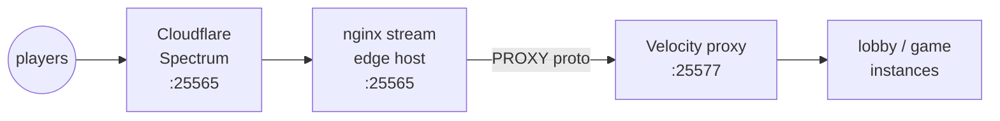

The Velocity proxy is what players connect to. In front of it you
typically want at least one more layer: a TCP-level reverse proxy
(nginx stream, HAProxy) for TLS termination on the dashboard, or
Cloudflare Spectrum for DDoS absorption on the Minecraft port. Both
work — both require a small amount of plumbing to keep the player's
real IP visible to Velocity (PROXY protocol), and to the cloud-plugin
inside lobby/game instances.

## What you'll build



End state: Cloudflare absorbs DDoS and provides anycast; nginx on the
edge host terminates Cloudflare's PROXY-protocol header and re-emits
its own to Velocity; Velocity sees the player's real IP; the
cloud-plugin records the real IP on player-join.

## Prerequisites

- A working Velocity proxy group from
  [Your First Network](/getting-started/your-first-network/) or any of
  the multi-game recipes.
- A Cloudflare account with Spectrum enabled on the zone (Spectrum
  Minecraft is a paid feature; everything below also works without
  Cloudflare — just remove the CF tier).
- An nginx build with the `stream` module (the Debian/Ubuntu
  `nginx-full` package ships with it).

## 1. Tell Velocity to expect PROXY protocol

In the proxy template's `velocity.toml`, switch the listener mode:

```toml
# templates/proxy/velocity.toml
bind = "0.0.0.0:25577"
player-info-forwarding-mode = "modern"
proxy-protocol = true            # accept PROXY v2 from upstream
```

Push and roll:

```bash
prexorctl template push templates/proxy/
prexorctl deploy proxy --strategy rolling
```

The Velocity proxy now refuses connections that don't carry a PROXY
header. Importantly, **don't** expose `:25577` directly — it would
reject every player.

## 2. Update the group to bind on the loopback only

The Velocity proxy should listen only where nginx can reach it, never
on the public interface:

```yaml
# proxy.yml
name: proxy
platform: velocity
scaling: { mode: STATIC, min: 1, max: 1 }
ports: { from: 25577, to: 25577 }
exposeOnHost: false       # do NOT bind to 0.0.0.0; nginx talks to localhost
resources: { memoryMB: 768 }
templates: [base-velocity, proxy]
placement:
  nodeSelector:
    role: edge            # pin to the edge node where nginx runs
```

```bash
prexorctl group apply -f proxy.yml
```

## 3. Install nginx stream on the edge host

```bash
sudo apt install nginx-full
```

Configure `/etc/nginx/nginx.conf` with a stream block:

```nginx
# /etc/nginx/nginx.conf  (excerpt)
stream {
    log_format mc_proxy '$remote_addr -> $upstream_addr [$time_local] '
                        '$status $bytes_sent';
    access_log /var/log/nginx/mc_proxy.log mc_proxy;

    upstream velocity {
        server 127.0.0.1:25577;
    }

    # Trust Cloudflare's incoming PROXY v2 header
    server {
        listen 25565 proxy_protocol;
        proxy_pass velocity;
        proxy_protocol on;          # forward a PROXY v2 to Velocity

        # Cloudflare Spectrum IP ranges — keep current
        set_real_ip_from 173.245.48.0/20;
        set_real_ip_from 103.21.244.0/22;
        set_real_ip_from 103.22.200.0/22;
        # … see https://www.cloudflare.com/ips/
    }
}
```

Reload:

```bash
sudo nginx -t && sudo systemctl reload nginx
```

For a setup without Cloudflare, drop the `set_real_ip_from` lines and
the `listen … proxy_protocol` directive on `:25565`. Players connect
direct to nginx, which still wraps the connection in PROXY v2 going to
Velocity.

## 4. Configure Cloudflare Spectrum

In the Cloudflare dashboard:

1. **DNS** → add an `A` record for `play.example.com` pointing at the
   edge host's public IPv4 (proxied: orange-cloud).
2. **Spectrum** → create a Minecraft application:
   - **Edge Port**: `25565`
   - **Origin**: `play.example.com:25565`
   - **PROXY Protocol**: `Enabled (v2)`
   - **IP Firewall**: `On`

Spectrum will now anycast `:25565`, terminate the player's TCP
connection at the nearest edge, and forward to nginx with a PROXY v2
header carrying the player's real IP.

## 5. Verify real-IP propagation

The cloud-plugin records the player's address on join. Connect a
client, then:

```bash
prexorctl player list --json | jq '.[0]'
# {
#   "uuid": "…",
#   "name": "PrexorJustin",
#   "address": "203.0.113.42",     ← real player IP, not Cloudflare/nginx
#   "currentInstance": "lobby-1",
#   "joinedAt": "2026-05-10T12:00:00Z"
# }
```

If `address` shows `127.0.0.1`, `172.x.x.x`, or a Cloudflare range,
PROXY protocol is broken somewhere — Velocity didn't receive the v2
header from nginx, or Cloudflare didn't send it.

## How to verify it works

Three quick checks:

1. **Direct port is closed.** From off-host: `nc -vz <edge-ip> 25577`
   should fail (refused). `nc -vz <edge-ip> 25565` should succeed.
2. **Real IP appears in audit log.** `prexorctl audit query --filter
   player.connect --since "10 min ago"` shows the real IP, not a
   proxy IP.
3. **Velocity log mentions PROXY v2.** `prexorctl logs daemon node-edge
   --instance proxy-1 | grep PROXY` shows accepted PROXY v2 headers.

## Common pitfalls

| Symptom | Likely cause |
|---|---|
| All players see "Connection closed" | Velocity has `proxy-protocol = true` but nginx isn't sending PROXY v2. Both ends must agree. |
| Real IP shows as edge host's IP | nginx didn't enable `proxy_protocol on;` on the upstream pass. |
| Cloudflare returns "no application configured" | Spectrum DNS hasn't propagated. Wait 60s or check the Spectrum analytics tab. |
| Players time out only from one continent | Cloudflare Spectrum's anycast ranges aren't on your `set_real_ip_from`. Update from https://www.cloudflare.com/ips/. |
| `prexorctl player list` shows real IP but bans don't stick | The `IP_BAN` plugin is whitelisting RFC1918 — disable that exception. |

## Where to go next

- [Recipes → BedWars Network](/recipes/bedwars-network/) — full
  multi-game stack behind the same edge tier.
- [Concepts → Security](/concepts/security/) — TLS, mTLS for the
  internal control plane.
- [Operations → Production Checklist](/operations/production-checklist/) —
  the must-have items before going live, including DDoS mitigation.
