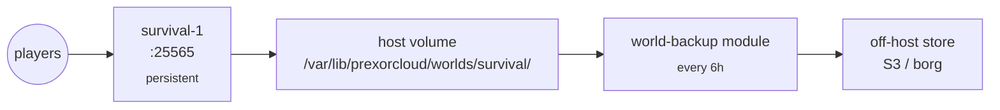

A single survival server with one persistent world, scheduled world
backups every six hours, and a Forge / Fabric / Paper mod-pack as a
template. Different from the multi-game pattern because the world is
state we cannot lose — instances cannot be ephemeral.

## What you'll build



End state: a single STATIC group pinned to one node, world directory
on a host volume that survives instance restarts, world tarballs
shipped off-host every six hours, retention pruned to 30 days.

## Prerequisites

- PrexorCloud v1.0+ controller and one daemon node with at least
  4 GiB RAM and ≥50 GiB free disk for the world.
- A mod-pack you maintain (CurseForge zip, Modrinth pack, or just a
  set of Paper plugins). This recipe doesn't ship one.
- Optional: an off-host store for world backups (S3, borg, restic).

## 1. Create the world directory and template

Decide on a stable host path for the world. Conventionally:

```bash
sudo mkdir -p /var/lib/prexorcloud/worlds/survival
sudo chown prexorcloud:prexorcloud /var/lib/prexorcloud/worlds/survival
```

Build the template under `templates/survival/`:

```
templates/survival/
├── plugins/
│   └── EssentialsX-2.20.1.jar
├── server.properties
├── paper-global.yml
├── bukkit.yml
├── ops.json
└── prexor.yml             # cloud-plugin config
```

In `paper-global.yml`, point the world directory at the host mount:

```yaml
# paper-global.yml
unsupported-settings:
  allow-permanent-block-break-exploits: false
spam-limiter:
  tab-spam-increment: 1
```

The world path itself comes from the group's `volumes` block (next
step). Paper writes worlds relative to the instance directory by
default; we'll bind-mount over that.

Push the template:

```bash
prexorctl template push templates/survival/
```

## 2. Define the group with a host volume

Save as `survival.yml`:

```yaml
name: survival
platform: paper
version: "1.21.4"
scaling: { mode: STATIC, min: 1, max: 1 }
ports: { from: 25565, to: 25565 }
exposeOnHost: true
resources:
  memoryMB: 4096
  jvmArgs:
    - "-XX:+UseG1GC"
    - "-XX:+ParallelRefProcEnabled"
    - "-XX:MaxGCPauseMillis=200"
templates: [base-paper, survival]
volumes:
  - hostPath: /var/lib/prexorcloud/worlds/survival
    mountPath: ./world
    readOnly: false
placement:
  nodeSelector:
    role: survival         # pin to a labelled node
  noEvict: true            # don't migrate during drain
```

Key ideas:

- `scaling.mode: STATIC` with `min == max == 1` — there is exactly
  one instance, ever.
- `volumes` bind-mounts the host's persistent world directory over
  the instance's `./world/`. The world survives every restart,
  redeploy, and template push.
- `placement.noEvict: true` tells the drain reconciler to leave this
  instance alone unless the node is being decommissioned.
- `placement.nodeSelector.role: survival` pins the group to a node
  labelled `role=survival` (set in the daemon's `daemon.yml`). Without
  this, the scheduler is free to schedule on any node — but the world
  volume only exists on one host.

Apply:

```bash
prexorctl group apply -f survival.yml
prexorctl instance list --group survival
# survival-1  node-survival   RUNNING  port=25565
```

## 3. Install the world-backup module

The `world-backup` module is a first-party platform module that
schedules world tarballs. Install:

```bash
# Download the signed bundle
curl -fsSL https://github.com/prexorjustin/prexorcloud/releases/latest/download/world-backup.cosign.bundle.tar -o /tmp/world-backup.tar
prexorctl module install /tmp/world-backup.tar
prexorctl module list
# world-backup   1.0.0   ACTIVE
```

Configure via the module's REST endpoint or its dashboard page:

```bash
curl -fsSL -X PUT \
  -H "Authorization: Bearer $(prexorctl token print --self)" \
  -H "Content-Type: application/json" \
  -d '{
    "group": "survival",
    "schedule": "0 */6 * * *",
    "destination": "s3://my-survival-backups/",
    "retention": { "keepDays": 30 },
    "preBackupCommand": "save-all flush",
    "postBackupCommand": "save-on"
  }' \
  https://controller.example.com:8080/api/v1/modules/world-backup/jobs
```

What this does each cycle:

1. Issue `save-all flush` via the cloud-plugin's RCON-equivalent
   command channel.
2. Wait for the save-completion ack on the SSE bus.
3. `save-off` (block writes briefly).
4. `tar -czf` the world directory on the daemon host.
5. `save-on`.
6. Upload the tarball to the configured destination.
7. Prune objects older than `keepDays`.

A successful run emits `WORLD_BACKUP_COMPLETED` on the SSE bus with
the tarball's size and SHA-256.

## 4. Lock down access

The default operator role can stop or delete the group. Add a
`survival-readonly` role for support staff:

```bash
prexorctl role create survival-readonly \
    --permission groups.view \
    --permission instances.view \
    --permission instances.console.read \
    --permission events.subscribe
```

Grant it via `prexorctl user assign-role <username> survival-readonly`.

## How to verify it works

```bash
# 1. Instance is running and players can connect
prexorctl instance describe survival-1
# NODE   node-survival
# PORT   25565
# STATE  RUNNING
# UPTIME 2h14m

# 2. World volume is mounted correctly
sudo ls /var/lib/prexorcloud/worlds/survival/
# level.dat  region/  playerdata/  …

# 3. Backup module is scheduled
prexorctl events follow --filter module
# WORLD_BACKUP_STARTED   survival   2026-05-10T18:00:00Z
# WORLD_BACKUP_COMPLETED survival   1.4 GiB   sha256:abcd…
```

In Minecraft, place a marker block at spawn, restart the instance with
`prexorctl instance stop survival-1 && prexorctl instance start survival`.
The block must still be there.

## Common pitfalls

| Symptom | Likely cause |
|---|---|
| World resets on every restart | `volumes` block missing or `mountPath` doesn't match `level-name` in `server.properties`. |
| Instance gets evicted on drain | `placement.noEvict: false` or unset. |
| Backup module silently does nothing | Cron expression has 6 fields instead of 5. Re-check the schedule. |
| World corruption after a backup | `save-off` skipped; the module bundles the pre/post commands precisely to prevent this. |

## Where to go next

- [Guides → Backup + Restore](/guides/backup-and-restore/) — the
  cluster-level backup that captures Mongo + Valkey + filesystem,
  separate from world tarballs.
- [Concepts → Groups, Instances, Templates](/concepts/groups-instances-templates/)
  — how the layered template chain works.
- [Guides → Crash Recovery](/guides/crash-recovery/) — what happens
  if the survival instance OOMs (and how to right-size memory).
