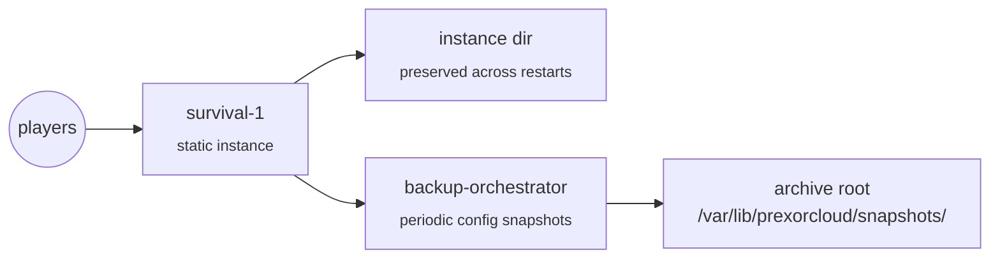

You'll stand up a single survival server whose world survives every restart and
template re-apply, then schedule periodic config snapshots with the
`backup-orchestrator` module. The world is state you can't lose, so the group is
`static`: exactly one instance with a stable identity and a preserved instance
directory.

## What you'll build



End state: a single `STATIC` group, one instance named `survival-1`, the
instance directory (including the world) preserved across restarts and template
re-applies, and the controller-side `backup-orchestrator` module writing config
snapshots to a controller-local archive root on a fixed interval.

## Before you start

- A PrexorCloud controller (v1.0+) and at least one daemon node with enough RAM
  and disk for the world.
- A `survival` template you maintain (a Paper plugin set, or a Forge/Fabric
  mod-pack). This recipe doesn't ship one.
- The `prexorctl` CLI, authenticated against your controller.

One thing to know up front about scope: the `backup-orchestrator` module
snapshots **config and small state files**, not binary world data. The
daemon-side file-read capability (`prexor.instance.files`) has a per-file read
cap, so world regions are out of reach until a `prexor.instance.snapshot`
capability lands. For full world backups, copy the preserved instance directory
off-host yourself (see [Off-host world backups](#off-host-world-backups)).

## 1. Build the survival template

Templates are versioned config + file layers. Lay out the survival template with
your server config and plugins or mods:

```
templates/survival/
├── plugins/
│   └── EssentialsX-2.20.1.jar
├── server.properties
├── bukkit.yml
└── ops.json
```

Manage templates with the `template` subcommands:

```bash
prexorctl template list
prexorctl template versions survival
prexorctl template rollback survival
```

Keep your world out of the template. The template is re-applied on each start;
anything it ships is layered onto the instance directory. The world stays put
because the group is `static` and the world path is listed in `protectedPaths`
(next step).

## 2. Create the static survival group

Create the group. `scalingMode STATIC` with `min == max == 1` means exactly one
instance, ever:

```bash
prexorctl group create \
  --name survival \
  --platform paper \
  --platform-version 1.21.4 \
  --template survival \
  --scaling-mode STATIC \
  --min 1 \
  --max 1 \
  --memory 4096 \
  --port-start 30000 \
  --port-end 30000
```

The controller stores each group as YAML under `groups/<name>.yml` — this file
is the single source of truth for the group, no database involved. Open
`groups/survival.yml` and set the persistence fields the create flags don't
cover:

```yaml
# groups/survival.yml
name: survival
platform: PAPER
platformVersion: "1.21.4"
jarFile: server.jar
templates: [survival]
scalingMode: STATIC
minInstances: 1
maxInstances: 1
memoryMb: 4096
portRangeStart: 30000
portRangeEnd: 30000
jvmArgs:
  - "-XX:+UseG1GC"
  - "-XX:+ParallelRefProcEnabled"
  - "-XX:MaxGCPauseMillis=200"
# Persistence
static: true
staticInstanceNames: [survival-1]
protectedPaths:
  - world
  - world_nether
  - world_the_end
# Pin to one node — the preserved instance dir lives on a single host
nodeAffinity: [node-survival]
```

What each field does:

- `static: true` tells the daemon to preserve the instance directory across
  restarts (`StartInstance.static_instance` in the daemon protocol). A dynamic
  instance gets a fresh directory each start; a static one is reused.
- `staticInstanceNames: [survival-1]` pins the instance identity. With this set,
  the scheduler expects exactly the IDs you list, verbatim. Without it, a static
  group with `minInstances: 1` would still produce `survival-1` (the default
  `{group}-{N}` numbering), but naming it explicitly makes the contract obvious.
- `protectedPaths` lists paths the daemon does **not** overwrite when it
  re-applies templates on start. Your world directories belong here, so a
  template push can never clobber them. `protectedPaths` is honoured for static
  groups only.
- `nodeAffinity: [node-survival]` keeps the instance on the node that holds its
  preserved directory. The directory is local to one daemon host, so the
  instance has to land there.

Verify the group:

```bash
prexorctl group info survival
```

## 3. Start and confirm the instance

Start the static instance and check it:

```bash
prexorctl instance start survival
prexorctl instance list --group survival
# survival-1   node-survival   RUNNING   port=30000
```

Inspect it:

```bash
prexorctl instance info survival-1
```

To prove persistence, place a marker block in-game, then restart:

```bash
prexorctl instance stop survival-1
prexorctl instance start survival
```

The marker block must still be there. Because the directory is preserved and the
world is in `protectedPaths`, the restart — and any subsequent `template
rollback` or new template version — leaves the world untouched.

## 4. Install the backup-orchestrator module

`backup-orchestrator` is a first-party controller module (id
`backup-orchestrator`, version `1.0.0`). It requires the `prexor.instance.files`
capability and stores snapshot records in Mongo. Install it from a signed
bundle:

```bash
prexorctl module install backup-orchestrator.jar
prexorctl module list
# backup-orchestrator   1.0.0   ...
```

`module install` auto-detects the signature sidecar
(`backup-orchestrator.jar.cosign.bundle` or `.sig`) and uploads it so the
controller verifies the signature against its trust root before installing. If
you've configured a module registry, you can install by spec instead:

```bash
prexorctl module install backup-orchestrator@1.0.0
```

## 5. Schedule periodic snapshots

The module reads its schedule from the controller process environment. Periodic
snapshots are opt-in: they run only when a positive interval **and** at least one
well-formed target are both set. Set these on the controller before (re)starting
it:

```bash
# Snapshot period, in minutes (0 or unset disables periodic snapshots)
PREXORCLOUD_BACKUP_INTERVAL_MINUTES=360
# Delay before the first run, in minutes (default 1)
PREXORCLOUD_BACKUP_INITIAL_DELAY_MINUTES=5
# Comma-separated nodeId/group/instanceId triples
PREXORCLOUD_BACKUP_TARGETS=node-survival/survival/survival-1
# Archive root (default /var/lib/prexorcloud/snapshots)
PREXORCLOUD_BACKUP_DIR=/var/lib/prexorcloud/snapshots
```

`PREXORCLOUD_BACKUP_TARGETS` is a comma-separated list of
`nodeId/group/instanceId` triples — the module can't enumerate live instances
from its context, so targets are explicit. A `360`-minute interval snapshots
every six hours. Malformed target tokens are skipped, not fatal; the node and
instance segments are required, the group segment may be blank for an ungrouped
instance.

On the next controller start, the module logs its schedule:

```
backup-orchestrator: periodic snapshots every PT6H for 1 target(s), first run in PT5M
```

If the interval or targets are missing, it logs that periodic snapshots are
disabled and stays REST-only.

Each snapshot reads the instance's config files over `prexor.instance.files`,
writes a `tar.gz` under the archive root, and persists a metadata record:
`archiveSizeBytes`, `archivePath`, `fileCount`, and `truncatedFiles` — the files
whose on-disk size exceeded the daemon's per-file read cap and were captured only
partially. A single unreachable instance is logged and skipped; it doesn't abort
the run.

## 6. Trigger and list snapshots over REST

The module mounts its REST surface under
`/api/v1/modules/backup-orchestrator/`. Trigger an on-demand snapshot:

```bash
curl -fsSL -X POST \
  -H "Content-Type: application/json" \
  -d '{
    "nodeId": "node-survival",
    "group": "survival",
    "instanceId": "survival-1"
  }' \
  https://controller.example.com:8080/api/v1/modules/backup-orchestrator/snapshots
```

`nodeId` and `instanceId` are required (a missing one returns `400`); `group` is
optional. A successful snapshot returns `201` with the metadata record; a failed
read returns `502`. List recent snapshots, optionally filtered to one instance:

```bash
curl -fsSL \
  "https://controller.example.com:8080/api/v1/modules/backup-orchestrator/snapshots?instance=survival-1&limit=20"
```

Fetch or delete a single record by id:

```bash
# GET    /api/v1/modules/backup-orchestrator/snapshots/{id}
# DELETE /api/v1/modules/backup-orchestrator/snapshots/{id}   -> 204
```

## Off-host world backups

The module captures config, not world regions. Ship the world off-host with a
plain file copy of the preserved instance directory. The archive root for module
snapshots and the world directory are both on the daemon host, so a cron job on
that node covers both:

```bash
# On node-survival, run every six hours
DEST=s3://my-survival-backups/$(date +%Y%m%dT%H%M%SZ)
aws s3 cp --recursive /var/lib/prexorcloud/snapshots/ "$DEST/snapshots/"
# Copy the preserved instance directory (world included)
aws s3 cp --recursive /var/lib/prexorcloud/instances/survival-1/ "$DEST/world/"
```

For a crash-consistent world copy, stop the instance first, or run
`save-off`/`save-all` in-game before the copy and `save-on` after.

## 7. Lock down access

The built-in `OPERATOR` role can stop or delete the group. Create a read-only
role for support staff with a comma-separated permission set:

```bash
prexorctl user role create \
  --name survival-readonly \
  --permissions groups.view,instances.view
```

Inspect a role and its full permission list:

```bash
prexorctl user role show survival-readonly
```

Assign it when you create the user:

```bash
prexorctl user create --username support --role survival-readonly
```

## Common pitfalls

| Symptom | Likely cause |
|---|---|
| World resets on restart | `static` is `false` or unset, so the instance directory isn't preserved. Set `static: true`. |
| World wiped after a template push | The world path isn't in `protectedPaths`, so the daemon overwrote it on re-apply. Add `world`, `world_nether`, `world_the_end`. |
| Instance scheduled on the wrong node | `nodeAffinity` is unset; the preserved directory only exists on one host. Pin with `nodeAffinity: [node-survival]`. |
| Two instances appear | `maxInstances > 1`, or `scalingMode` isn't `STATIC`. A persistent world needs exactly one writer. |
| Periodic snapshots never run | `PREXORCLOUD_BACKUP_INTERVAL_MINUTES` is `0`/unset, or `PREXORCLOUD_BACKUP_TARGETS` has no valid `node/group/instance` triple. Both are required. |
| Snapshot record lists `truncatedFiles` | Those files exceeded the daemon's per-file read cap. Expected for large files; config files are normally well under it. |

## Where to go next

- [Concepts → Groups, instances, templates](/concepts/groups-instances-templates/)
  — how static groups, the instance directory, and the template layer chain fit
  together.
- [Guides → Backup and restore](/guides/backup-and-restore/) — the
  cluster-level backup that captures Mongo and the controller's filesystem state,
  separate from per-instance snapshots.
- [Reference → REST API](/reference/rest-api/) — every group field,
  including `static`, `staticInstanceNames`, and `protectedPaths`.
